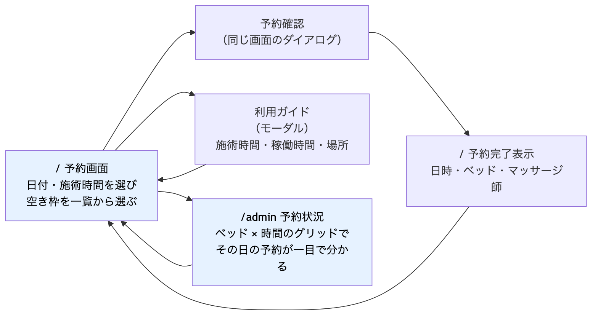
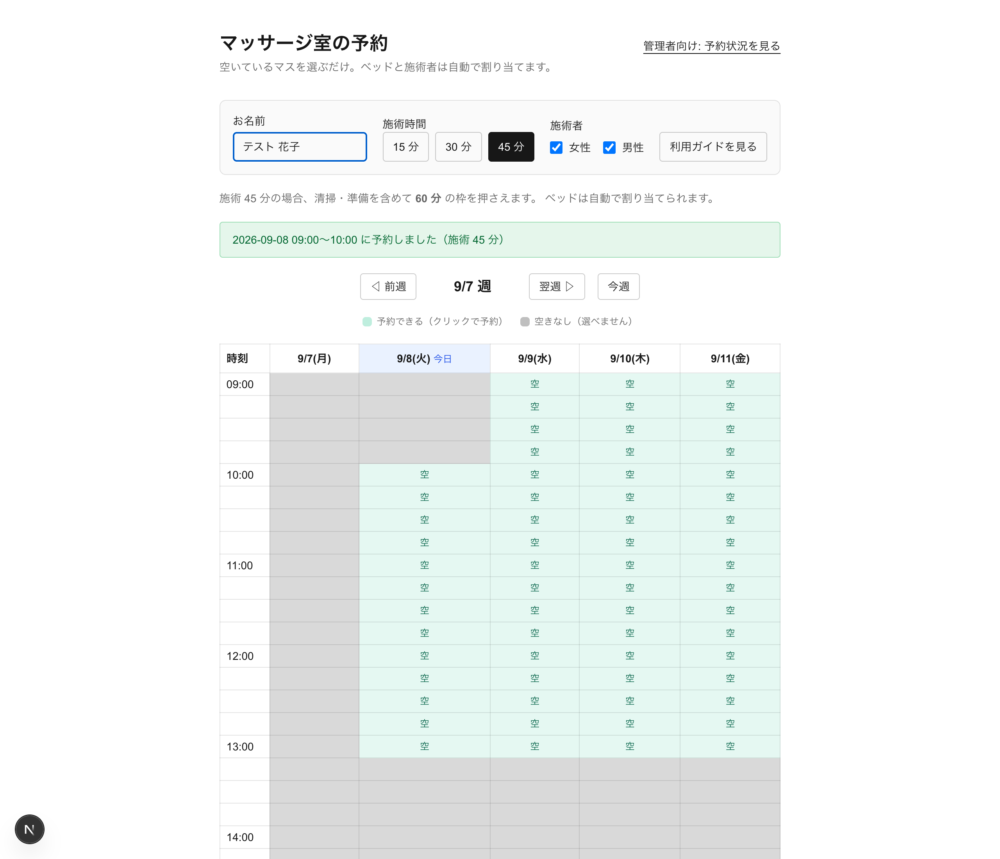
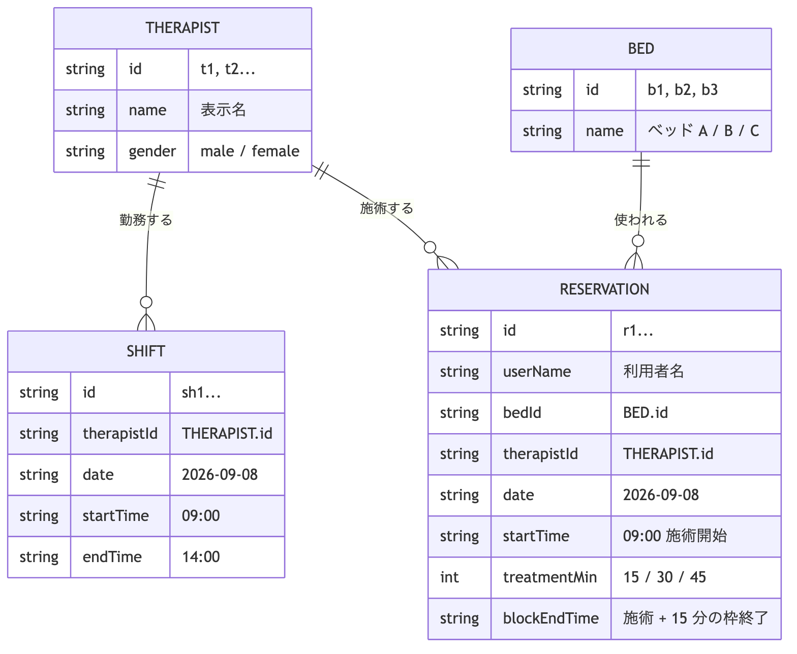
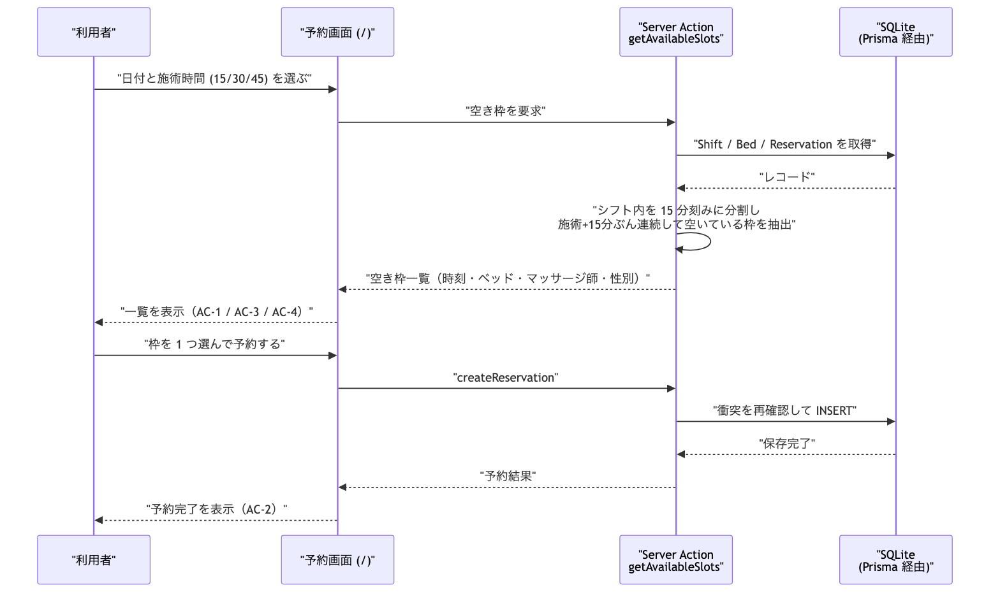
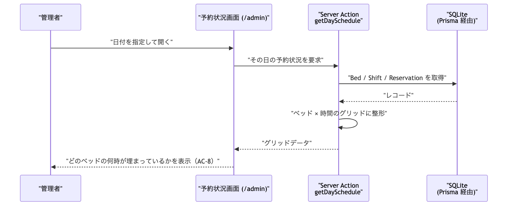
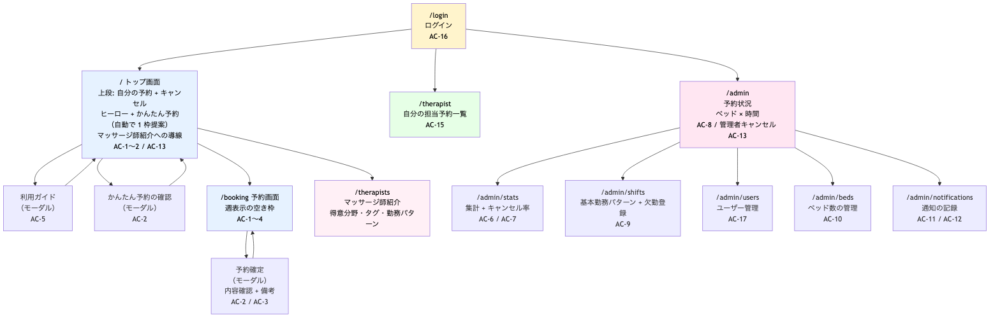
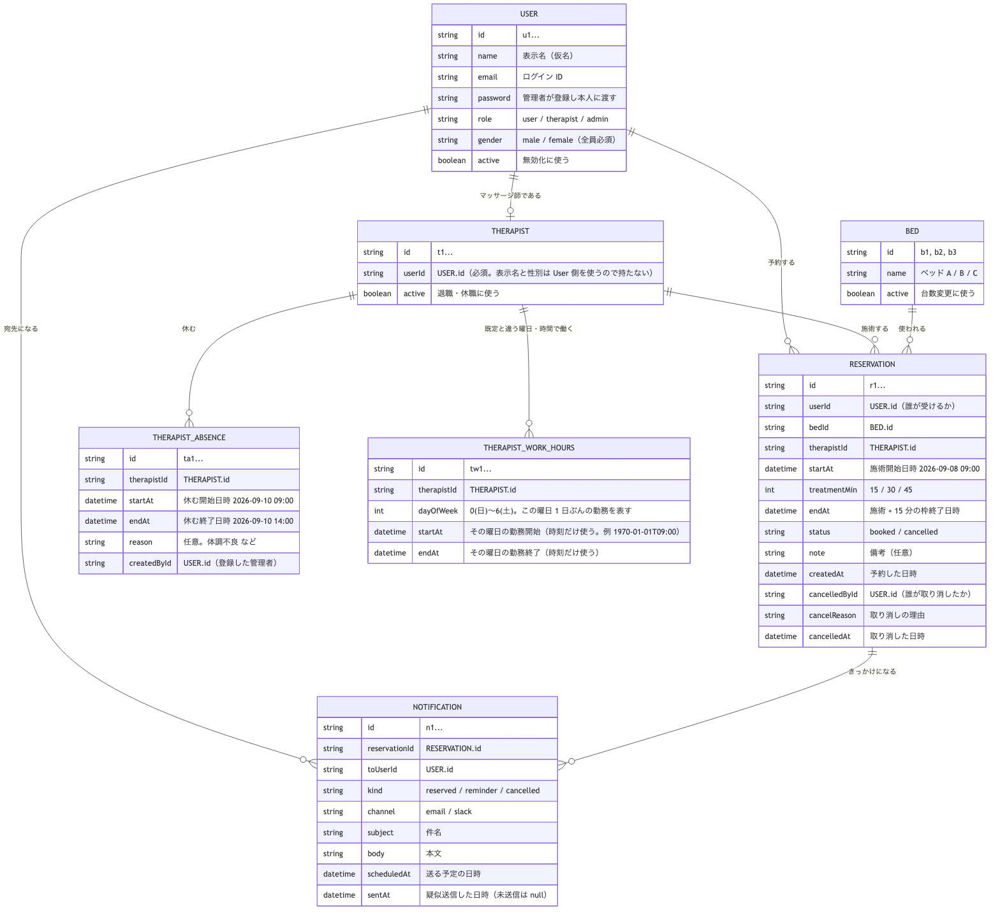

# Design

**この文書は 2 部構成。**

| 版 | 対象 | 状態 |
|---|---|---|
| 第 1 版（本文前半） | PoC。画面 2 枚 + モーダル 1 つ、AC-1〜AC-5 / AC-8 | **実装済み** |
| **第 2 版（後半「フルスコープ設計」）** | 画面 9 枚 + モーダル 2 つ、必須 AC 14 件。3 人で分担 | **これから実装** |

第 1 版は記録として残す。**これから作るものは第 2 版**を読むこと。

---

対象: PoC（1 時間で動くものを作る）。実装期間はインターン残り 2 日。
制約により、図ごとの確認往復は省略し、テックリードが判断した内容を明示する形で進める。

## 要件の前提（requirements.md から引用）

要件宣言:

> 私たちは、**沖縄拠点の社員 約 700 人**が「マッサージ室を使いたいのに、予約の手順が煩雑で手前で諦めてしまう。
> そもそも 15 分から受けられることを知らない」状態を、**現行スケジュールツールとは独立した予約 Web アプリ**によって、
> **空き枠を一覧から選ぶだけで予約でき、その予約データがそのまま利用実績として管理者に見える**状態にする。

管理者が選んだコア 3 件（3 つしか作れないなら残すもの）:

| # | 内容 |
|---|---|
| AC-1 | 利用者が空き枠を一覧で見られる |
| AC-2 | 空き枠を 1 つ選ぶだけで予約が完了する |
| AC-8 | 管理者がベッド別・時間帯別の予約状況を見られる |

規模: 利用者 約 700 人 / ベッド 3 台 / 稼働 9:00〜14:00・15:00〜19:00（計 9 時間）/ 1 日の枠上限 27〜54。

## MVP の範囲

**「予約体験まで」を MVP とする。** 対象は次の 6 件。

| # | 内容 | 位置づけ |
|---|---|---|
| AC-1 | 空き枠の一覧表示 | コア |
| AC-2 | 空き枠を 1 つ選んで予約完了 | コア |
| AC-3 | 施術時間 15 / 30 / 45 分の選択（枠は施術時間 + 15 分） | 予約体験 |
| AC-4 | 各枠にマッサージ師の性別を表示 | 予約体験 |
| AC-5 | 利用ガイド（施術時間・稼働時間・場所・ベッド数） | 予約体験 |
| AC-8 | 管理者のベッド別・時間帯別の予約状況画面 | コア |

シフト（AC-9）とマスタ（AC-10）は**画面を作らず、シード（初期投入）データで用意する**。
理由: AC-1 が動くにはシフトとマスタのデータが必要だが、**必要なのはデータであって画面ではない**。
マスタの変更頻度（Q-13）は未確認であり、頻度が低ければ管理画面は本当に不要な可能性がある。

### PoC（最初の 1 時間）で完成させる範囲

さらに絞り、**AC-1 / AC-2 / AC-3 / AC-4 / AC-8** を 1 時間の目標とする。
AC-5（利用ガイド）は静的な文言のみで実装量が小さいため、時間が余れば同じ 1 時間内に入れる。

## 成果物の種類と技術構成

| 項目 | 選択 | 理由 |
|---|---|---|
| 種類 | Web アプリケーション | 利用者・管理者・マッサージ師の 3 者が同じ予約データを読み書きし、端末は業務用 PC（Q-6） |
| フレームワーク | **Next.js（App Router）+ TypeScript** | 学生が座学で触った唯一のフレームワーク。画面とサーバ処理を 1 つのプロジェクトで書ける |
| データベース | **SQLite** | ファイル 1 個で動きサーバ構築が不要。1 時間の PoC でも環境構築に時間を取られない |
| DB アクセス | **Prisma 6.19.3** | スキーマファイルが ER 図とほぼ 1 対 1 で対応し、設計書がそのままコードになる。DB 未経験でも読める |
| サーバ処理 | **Server Actions** | API ルートを別途書かずに、画面から直接サーバ関数を呼べる。ファイル数が減る |
| スタイル | Tailwind CSS | `create-next-app` に同梱されており追加設定が不要 |
| 認証 | **なし**（PoC） | 画面の URL で役割を分ける（`/` = 利用者、`/admin` = 管理者）。認証は MVP 外 |

**この構成の弱点（正直に書く）**: 認証が無いため、誰でも管理者画面を開ける。
本番運用には認証が必須。PoC では「予約と記録が一本で通ること」の確認を優先し、認証は後回しにする。

## 画面遷移図



~~~mermaid
flowchart LR
  S1["/ 予約画面<br/>日付・施術時間を選び<br/>空き枠を一覧から選ぶ"] --> S2["予約確認<br/>（同じ画面のダイアログ）"]
  S2 --> S3["/ 予約完了表示<br/>日時・ベッド・マッサージ師"]
  S3 --> S1
  S1 --> S4["利用ガイド<br/>（モーダル）<br/>施術時間・稼働時間・場所"]
  S4 --> S1
  S1 --> S5["/admin 予約状況<br/>ベッド × 時間のグリッドで<br/>その日の予約が一目で分かる"]
  S5 --> S1

  style S1 fill:#e6f2ff,color:#000000
  style S5 fill:#e6f2ff,color:#000000
~~~

| 画面 | 役割 | 対応 AC |
|---|---|---|
| `/` 予約画面 | **週表示のスケジュール表**（列 = 月〜金、行 = 9:00〜19:00）。空いているマスをクリックすると予約が完了する | AC-1 / AC-2 / AC-3 / AC-4 |
| 利用ガイド（モーダル） | 施術時間の選択肢、稼働時間、場所、ベッド数をまとめて読める | AC-5 |
| `/admin` 予約状況 | ベッド × 時間のグリッドで、その日どこが埋まっているかが一目で分かる | AC-8 |

画面は **2 枚 + モーダル 1 つ**。予約完了は画面遷移せず、同じ画面に結果を出す（実装量を減らすため）。

### 予約画面（週表示）の仕様 — 2026-09-08 変更

学生が持参したホワイトボードの図に合わせて、1 日ぶんの一覧から**週表示のスケジュール表**へ変更した。



| 要素 | 仕様 |
|---|---|
| 列 | 選んだ日付が含まれる週の**月〜金**。`◁ 前週` / `翌週 ▷` / `今週` で移動 |
| 行 | 9:00〜19:00 を 15 分刻み |
| セル（緑・「空」） | 予約できる。クリックすると確認ののち予約が確定する |
| セル（灰色） | 選べない。空きなし・休憩時間・稼働時間外・過去の日付・**今日のうちもう過ぎた時刻**（`isStartPassed`。ちょうど今始まる枠も選ばせない。画面は 1 分ごとに更新し、**サーバーも保存時に同じ判定で弾く**） |
| **ベッドの列は作らない** | A / B / C のうち**1 台でも空いていれば予約可**。全部埋まって初めて灰色になる。ベッドはシステムが割り当てる |
| 施術者 | **チェックボックス**で選ぶ。性別（女性 / 男性）の枠の中に、その性別の施術者が並ぶ。**性別のチェックはそのグループをまとめて ON / OFF する操作**で、実際の絞り込み条件は「チェックの入っている施術者」だけ（Issue #9）。一部だけ選ぶと性別側は中間状態（■）になる。**1 人も選ばれていなければ空き枠は出ない**（その旨を画面に出す） |

この変更により、当初の「1 日ぶんのカード一覧」は廃止した。
週全体の空き具合が一目で分かるため、「いつなら空いているか」を探す手間が減る。

## データ構造



~~~mermaid
erDiagram
  THERAPIST ||--o{ SHIFT : "勤務する"
  THERAPIST ||--o{ RESERVATION : "施術する"
  BED ||--o{ RESERVATION : "使われる"

  THERAPIST {
    string id "t1, t2..."
    string name "表示名"
    string gender "male / female"
  }
  BED {
    string id "b1, b2, b3"
    string name "ベッド A / B / C"
  }
  SHIFT {
    string id "sh1..."
    string therapistId "THERAPIST.id"
    string date "2026-09-08"
    string startTime "09:00"
    string endTime "14:00"
  }
  RESERVATION {
    string id "r1..."
    string userName "利用者名"
    string bedId "BED.id"
    string therapistId "THERAPIST.id"
    string date "2026-09-08"
    string startTime "09:00 施術開始"
    int treatmentMin "15 / 30 / 45"
    string blockEndTime "施術 + 15 分の枠終了"
  }
~~~

設計上の判断:

- **ベッド数は固定値にせずテーブルで持つ。** R-1（午前はマッサージ師 4 人だがベッドは 3 台）が未確認のため、
  台数が変わってもデータの追加だけで対応できるようにする。
- **`blockEndTime` を保存する。** 「施術時間 + 15 分」の計算結果を毎回やり直さずに衝突判定できる。
- 日付と時刻は `"2026-09-08"` `"09:00"` の文字列で持つ。PoC では日時型の扱いに時間を取られないことを優先する。

規模への耐性: 1 日最大 54 件 × 営業日 250 日 ≒ 年 13,500 件。SQLite で十分に扱える規模。
利用者 700 人が同時に押し寄せる業務ではないため、同時接続の負荷も問題にならない。

## 処理の流れ

### 利用者が予約する（AC-1 / AC-2 / AC-3 / AC-4）



~~~mermaid
sequenceDiagram
  participant U as "利用者"
  participant P as "予約画面 (/)"
  participant A as "Server Action<br/>getAvailableSlots"
  participant DB as "SQLite<br/>(Prisma 経由)"

  U->>P: "日付と施術時間 (15/30/45) を選ぶ"
  P->>A: "空き枠を要求"
  A->>DB: "Shift / Bed / Reservation を取得"
  DB-->>A: "レコード"
  A->>A: "シフト内を 15 分刻みに分割し<br/>施術+15分ぶん連続して空いている枠を抽出"
  A-->>P: "空き枠一覧（時刻・ベッド・マッサージ師・性別）"
  P-->>U: "一覧を表示（AC-1 / AC-3 / AC-4）"
  U->>P: "枠を 1 つ選んで予約する"
  P->>A: "createReservation"
  A->>DB: "衝突を再確認して INSERT"
  DB-->>A: "保存完了"
  A-->>P: "予約結果"
  P-->>U: "予約完了を表示（AC-2）"
~~~

**空き枠を出す計算（この設計の心臓部）**:

1. その日のシフトを取得する（マッサージ師ごとの勤務時間帯）
2. 勤務時間帯を 15 分刻みに分割する
3. 各時刻について、「施術時間 + 15 分」ぶん連続して空いているかを調べる
4. 性別の希望（複数可）があれば、**その条件を満たす施術者の中から**割り当てる
   （割り当ててから絞り込むと、先に別の性別が選ばれた時刻が候補ごと消えてしまう）
5. 条件を満たす人が複数いるときに**誰を選ぶか**は、次の順で決める（2026-09-11 追加）
   1. **その日の担当時間（施術 + 清掃の 15 分）が少ない人**を優先する。まだ担当が無い人は 0 分なので必ず先に選ばれる
   2. 担当時間が並んだら、**時間帯ごとに順番をずらす**（9:00 は 1 番目、9:15 は 2 番目…）
6. ベッドが 1 台でも空いていればその時刻は予約可能とし、空いているベッドを 1 台割り当てる
7. 結果を「時刻 / ベッド / マッサージ師 / 性別」の一覧として返す

利用者はマッサージ師を指名しない（AC-2「個別に指名する操作は不要」）。**ベッドとマッサージ師はシステムが割り当てる。**

**5 を足した理由（2026-09-11）**: それまでは「勤務リストの先頭から最初に空いている人」を選んでいたため、
**予約が少ないうちは毎回同じ人に割り当たっていた**（午前はいつも同じ人になる）。
担当の偏りは、集計画面（A-2）で見たい「ベッド別の偏り」と同じ問題が人にも起きている状態だった。
1 だけだと全員 0 分の朝いちばんに先頭の人へ寄るため、2 の「時間帯ごとのずらし」と組み合わせている。

**保存するときの確認（2026-09-11 追加）**: 予約を保存する直前に、指定されたマッサージ師が
**本当にその時間に勤務していて、他の予約と重なっていないか**を `canAssignTherapist` で確かめる。
保存処理は画面を通さずに直接呼べるため、画面が出した候補をそのまま信じない。

### 管理者が予約状況を見る（AC-8）



~~~mermaid
sequenceDiagram
  participant M as "管理者"
  participant P as "予約状況画面 (/admin)"
  participant A as "Server Action<br/>getDaySchedule"
  participant DB as "SQLite<br/>(Prisma 経由)"

  M->>P: "日付を指定して開く"
  P->>A: "その日の予約状況を要求"
  A->>DB: "Bed / Shift / Reservation を取得"
  DB-->>A: "レコード"
  A->>A: "ベッド × 時間のグリッドに整形"
  A-->>P: "グリッドデータ"
  P-->>M: "どのベッドの何時が埋まっているかを表示（AC-8）"
~~~

## API / 主要処理

Server Actions として実装する（別途 API ルートは作らない）。

| 名前 | 入力 | 出力 | 対応する受け入れ基準 |
|---|---|---|---|
| `getAvailableSlots` | 日付、施術時間（15/30/45）、**希望する性別の配列（任意）** | 空き枠の配列（時刻・ベッド・マッサージ師・性別） | AC-1 / AC-3 / AC-4 |
| `fetchWeekSlots` | 週の月曜日、施術時間、性別の配列 | 日付ごとの「開始時刻 → 空き枠」。週表示の表を描くのに使う | AC-1 / AC-3 / AC-4 |
| `createReservation` | 日付、開始時刻、施術時間、ベッド、マッサージ師、利用者名 | 成功なら予約内容、失敗なら理由 | AC-2 |
| `getDaySchedule` | 日付 | ベッド × 時間のグリッドデータ | AC-8 |
| `seed`（スクリプト） | なし | マッサージ師 4 名・ベッド 3 台・当日〜翌週のシフトを投入 | AC-9 / AC-10 の代替 |

シードデータの内容（要件の Q-3 に合わせる）:

- マッサージ師: 午前は女性 1 名 + 男性 3 名、午後は男性 3 名
- ベッド: A / B / C の 3 台
- シフト: 午前 9:00〜14:00、午後 15:00〜19:00

## AI エージェント / チャットボット / Skill

**不要。**

理由: 主目的は「空き枠を選んで予約する」「予約データを集計して見せる」であり、
どちらも手順が確定した処理で実現できる。AI に任せるべき「毎回同じ基準で人が判断している作業」が存在しない。

## 状態管理・エラー表示

| 場面 | 利用者に見せるもの |
|---|---|
| 空き枠が 1 つも無い | 表のマスがすべて灰色になる。凡例で「空きなし（選べません）」と示す |
| マスを押した後、他の人に先を越された | 「たった今この枠は埋まりました。表を更新します」と表示し、自動で表を取り直す |
| 利用者名が未入力 | ボタンを押せない状態にし、「お名前を入力してください」と添える |
| 保存に失敗した | 「保存できませんでした。もう一度お試しください」と表示し、入力内容は消さない |

**重複予約の防止**: `createReservation` の中で、保存の直前にもう一度衝突を確認する。
一覧を表示してから予約するまでの間に他の人が予約する可能性があるため。
PoC では利用者が少ないため厳密な排他制御は行わないが、**この確認だけは必ず入れる**。

## テスト方針

| 受け入れ基準 | 確認方法 | 担当 |
|---|---|---|
| AC-1 空き枠の一覧表示 | 画面確認（シードデータの日付を開き、枠が並ぶこと） | 学生 |
| AC-2 1 クリック予約 | 画面確認（予約後に一覧からその枠が消えること） | 学生 |
| AC-3 施術時間の選択 | 画面確認（15 分を選ぶと 30 分ぶん、45 分を選ぶと 60 分ぶん枠が押さえられること） | 学生 |
| AC-4 性別の表示 | 画面確認（各枠に女性／男性が表示されること） | 学生 |
| AC-5 利用ガイド | 画面確認（モーダルに施術時間・稼働時間・場所・ベッド数が載っていること） | 学生 |
| AC-8 予約状況グリッド | 画面確認（予約した枠が `/admin` のグリッドで埋まって見えること） | 学生 |
| 空き枠の計算ロジック | **自動テスト**（施術時間ごとに正しい枠数が出るか、予約済みの枠が除外されるか） | Claude が作成、学生が実行 |

PoC の 1 時間では画面確認を優先する。自動テストは空き枠の計算だけに絞る。
計算ロジックは目視で正しさを判断しにくく、間違っていても画面上はそれらしく見えてしまうため。

## 作らないもの

| 外すもの | 理由 |
|---|---|
| 認証・ログイン | PoC では「予約と記録が一本で通ること」の確認を優先。URL で役割を分ける |
| AC-6 / AC-7 集計画面 | 管理者がコアに選んだのは AC-8（現状把握）であり集計ではなかった。予約データは貯まるので後から追加できる |
| AC-9 シフト登録画面 | シードデータで代替する。必要なのはデータであって画面ではない |
| AC-10 マスタ管理画面 | 同上。変更頻度（Q-13）が未確認で、低ければ本当に不要 |
| AC-11 / AC-12 通知（メール・Slack） | 外部連携は環境準備のリスクが大きく、1 時間の PoC には入らない |
| AC-13 キャンセル | 「後」に分類済み |
| 予約後のマッサージ師の予定変更への対応 | 要件で「例外・低頻度、システムで考慮不要」と確認済み |

## 引き継ぐ未確認事項

| # | 内容 | 設計上の扱い |
|---|---|---|
| R-1 | 午前はマッサージ師 4 人だがベッドは 3 台。ベッドは何台か | ベッドをテーブルで持ち可変にした。台数が判明したらシードデータを直すだけでよい |
| R-2 | 午後に女性マッサージ師がいないのは常にそうか | シフトデータで表現するため設計上の障害にならない |
| Q-13 | ベッド・マッサージ師の追加変更の頻度 | 低ければ AC-10 は不要のまま。高ければ MVP 後に追加する |

## 設計宣言（第 1 版・PoC）

> **AC-1 / AC-2 / AC-3 / AC-4 / AC-8（時間が許せば AC-5）を、Next.js（App Router）+ TypeScript + SQLite + Prisma で作る。**
> 画面は **2 枚（`/` 予約画面、`/admin` 予約状況）とモーダル 1 つ**、
> データは **Therapist / Bed / Shift / Reservation の 4 テーブル**、
> 受け入れ基準は **画面確認**（空き枠の計算ロジックのみ自動テスト）で確認する。
> シフトとマスタは画面を作らずシードデータで用意し、認証と通知は MVP から外す。

確認: 学生 [x]（2026-09-08） / メンター [ ]

---

# 第 2 版: フルスコープ設計（2026-09-09）

体制が **3 人 + AI** になったため、MVP から外していた基準を戻し、必須 14 件を対象にする。
第 1 版との差分だけでなく、**3 人が同時に手を動かせるようにファイル分割まで決める**のがこの版の目的。

## 対象とする受け入れ基準

| 区分 | # | 内容 | 第 1 版 |
|---|---|---|---|
| 利用者 | AC-1〜AC-4 | 空き枠一覧・1 クリック予約・施術時間・性別 | 実装済み（改修あり） |
| 利用者 | AC-5 | 利用ガイド | 実装済み |
| 利用者 | AC-13 | 自分の予約をキャンセルする | **新規** |
| マッサージ師 | AC-15 | 自分の予約状況を見る | **新規** |
| 管理者 | AC-6 / AC-7 | 集計（ユニーク利用者数・時間帯別・ベッド別） | **新規** |
| 管理者 | AC-8 | 予約状況（ベッド × 時間） | 実装済み（キャンセル機能を追加） |
| 管理者 | AC-9 | 基本勤務パターン + 欠勤管理（**管理者のみ**） | **新規** |
| 管理者 | AC-10 | ベッド数の管理 | **新規** |
| 通知 | AC-11 / AC-12 | 予約確定時・15 分前の通知 | **新規（疑似送信）** |
| 認証 | AC-16 / AC-17 | ログイン / ユーザー管理 | **新規** |

対象外のまま: **AC-14**（シフトの繰り返し登録）。

## 実装前に決めた 4 点（テックリード判断）

| # | 論点 | 決定 | 理由 |
|---|---|---|---|
| **D-1** | ログインの方式 | **メールアドレス + パスワード。サインアップ（自己登録）は作らない。**アカウントは**管理者がユーザー管理画面で登録**し、初期パスワードを手渡し／DM で本人に渡す。最初の管理者アカウントはシードデータで用意する | 社内アプリなので自己登録は不要（部外者がアカウントを作れてしまう）。**将来は社内のアカウント DB と連携してメールアドレスのみで認証する**が、インターンでは社内 DB に接続できないため今回はパスワード方式にする |
| **D-2** | 通知（AC-11 / AC-12）の実体 | **実際には送信しない。**`Notification` テーブルに「誰に・どの経路で・何を・いつ送るか」を記録し、管理画面で一覧表示する。15 分前通知は予約時に予約レコードとして作り、`scheduledAt` を持たせる | 誤送信のリスクと、社内メール／Slack の環境準備。**「通知が飛ぶ設計になっている」ことは画面で示せる**ため、発表の価値は落ちない |
| **D-3** | キャンセル期限 | **利用者は施術開始の 2 時間前まで。管理者はいつでも可** | 現行運用が「施術 2 時間前の自動メールに返信してキャンセル」なので、そこに合わせる |
| **D-4** | 予約モーダルで入力する情報 | 施術時間・希望する施術者は**表の上（絞り込み）で先に選ぶ**。モーダルは「日時・施術時間・担当・ベッドの**確認**＋備考（任意）」＋確定ボタン。**利用者名はログイン情報から自動で入る** | 施術時間で押さえる枠の長さが変わる（15 分→30 分 / 45 分→60 分）ため、**枠を選んだ後に施術時間を決めると「選んだ枠に入らない」が起きる**。ログイン導入で名前入力が不要になり、モーダルは軽くなる |
| **D-5**（Issue #9） | 希望する施術者を、どこで・どう指定するか | **表の上の絞り込みだけで指定する。**モーダルからは変更できない。条件として持つのは**施術者 id の 1 種類だけ**とし、性別のチェックは「その性別の施術者をまとめて選ぶ」操作にする | モーダルで性別や施術者を変えられるようにすると、**表の上の絞り込みと二重管理になり**、変更のたびに担当とベッドをその場で再探索する仕様が必要になる（スコープが広がる）。条件を施術者 id の 1 種類に寄せれば、割り当ての分岐は増えない |

### D-2 の改訂（2026-09-10）: マッサージ師向け通知を Slack 実送信に変更

対象は **AC-11（予約確定時）** と **キャンセル時にマッサージ師へも通知する新規基準（AC-18、下記）** の 2 件のみ。AC-12（施術 15 分前のリマインド）は当初対象外だったが、**同日中に方針を追加変更し、AC-12 も対象に含めた**（下記「D-2 の再改訂」を参照）。

| 論点 | 決定 | 理由 |
|---|---|---|
| 実送信にするか | **する。**`Notification` テーブルへの記録はこの 2 件については行わず、Slack API（`chat.postMessage`）で実際に DM を送る | 中山さんの判断。「疑似送信では施術者が予約を把握できたか確認できない」ため、AC-11 本来の目的（マッサージ師が予約を把握する手段）に対して実効性を持たせる |
| 施術者の Slack User ID の特定方法 | **`User.email` を使い、送信のたびに Slack の `users.lookupByEmail` API で引く。**DB には保存しない | メールアドレスは登録済みで一意。追加のマスタ管理（Slack ID の手入力・保守）が要らない。**社内メールと Slack のメールが一致していない施術者がいる場合は送信できない**（既知のリスクとして残す） |
| 送信失敗時の扱い | **失敗しても予約の確定／キャンセル自体は成立させる。**エラーはサーバーログに出すのみで、利用者・管理者には出さない | 通知は付随機能。Slack 側の一時的な不調で予約そのものができなくなるのは本末転倒 |
| 開発中のテスト送信 | **中山さん本人の Slack アカウント宛でのみ、実際に DM を送ってテストしてよい**（他の施術者役アカウント宛には送らない） | 誤送信のリスク（D-2 が元々懸念していた点）を、テスト対象を本人に限定することで抑える |
| Bot Token の管理 | `SLACK_BOT_TOKEN` を環境変数で管理し、リポジトリには含めない | プロジェクトのセキュリティ方針（CLAUDE.md）どおり |

### D-2 の再改訂（2026-09-10）: AC-12（施術15分前のリマインド）も Slack 実送信の対象にする

中山さんの追加判断: 「利用者・マッサージ師の両方に、施術15分前のリマインドも実際に Slack で送りたい。利用者向けにはキャンセル導線のリンクも入れたい」。

| 論点 | 決定 | 理由 |
|---|---|---|
| 対象を広げるか | **広げる。**AC-12（利用者・マッサージ師の双方）も疑似送信をやめ、Slack DM で実送信する | AC-11 / AC-18 と一貫させる。`Notification` テーブルへの記録はここでも行わない |
| 「15分前になった」をどう検知するか | Next.js のサーバーはリクエスト駆動でしか動かないため、**外部から定期的に叩く API（`GET /api/cron/remind`）を新設**する。本番でどこにデプロイするにせよ最終的にこの形が必要になるため、最初からこの構成にする | 中山さんが選択。開発中だけ動く簡易タイマー（サーバー内 `setInterval`）は、再起動やデプロイ環境によって動かなくなるため見送った |
| 二重送信の防止 | `Reservation.reminderSentAt`（新規カラム）に送信済み日時を記録し、未送信のものだけを対象にする | `Notification` テーブルに記録しない方針のため、別途「送ったかどうか」だけを持つ最小限のフラグが必要 |
| API の保護 | `CRON_SECRET` を環境変数で持ち、`Authorization: Bearer <CRON_SECRET>` が一致しないと実行しない。未設定なら常に拒否する（フェイルクローズ） | 実際に DM を送信するエンドポイントを誰でも叩ける状態にしない |
| 利用者向けメッセージのキャンセル導線 | 「自分の予約」セクション（`/#my-reservations`）へのリンクを入れる。**リンク自体はキャンセルを実行せず、確認画面へ誘導するだけ** | リンクを踏んだだけで予約が取り消される設計は事故のもと。既存のキャンセル確認モーダルに乗せるのが安全 |
| メッセージの文面 | 全通知（確定・キャンセル・リマインド）を、中山さんが共有した社内Botメッセージの例（絵文字・ボット名乗り・リンクの見せ方）を参考にしたトーンに統一した | 「メッセージが寂しい」という指摘への対応。`lib/notification-messages.ts` に集約 |

この再改訂により、AC-12 も含めて `Notification` テーブルは今のところ使われない。**画面一覧の 9（`/admin/notifications`）は表示する記録が無い状態**になる。このギャップ（AC-11/AC-12/AC-18 いずれも記録が残らない）は残課題として review.md に送る。

### D-2 の三度目の改訂（2026-09-10）: AC-12 を「施術15分前」から「毎朝9時の一括通知」に変更

デプロイ先が **Vercel（無料の Hobby プラン）** に決まったことを受けての変更。Vercel の Cron Jobs は
**Hobby プランだと1日1回までしか実行できない**ため、「15分ごとにチェックする」という前提（D-2 の再改訂）が
そのままでは成立しなくなった。中山さんの判断で、「15分前」をやめて「朝9時にその日の予約をまとめて知らせる」
方式に変更した。

| 論点 | 決定 | 理由 |
|---|---|---|
| 通知タイミング | 施術15分前 → **毎朝9時（JST）に、その日の予約をまとめて1回通知** | Vercel Hobby プランの Cron が1日1回までのため。「施術を忘れる」対策としては15分前の方が理想だが、無料プランの制約内で実現できる形にした |
| マッサージ師への通知の粒度 | 予約1件ごとに1通 → **その日担当する予約をすべて1通にまとめる**（中山さんの指示） | 1日に複数件担当することが普通にあるため、予約の件数だけ DM が届くと逆にわずらわしい |
| 利用者への通知の粒度 | 予約1件ごとに1通 → **その日の自分の予約をまとめて1通**（複数あれば箇条書き） | マッサージ師と同じ考え方で統一。実際には利用者は1日1件が大半 |
| Cron の設定方法 | `massage-booking/vercel.json` に `crons` を1本定義（`schedule: "0 0 * * *"` = UTC 0:00 = JST 9:00）。Vercel の Cron は `CRON_SECRET` 環境変数を設定するだけで `Authorization: Bearer <CRON_SECRET>` を自動で付けて呼んでくれるため、既存の認可の仕組みをそのまま使える | Vercel のドキュメントで案内されている標準的なやり方 |
| ローカルでの自動実行 | 本番と同じ毎朝9時に、ローカルの crontab から `curl` で叩く設定を追加する（dev サーバーが起動している時だけ動く） | 中山さんの要望。本番の Vercel Cron とは別に、ローカルでも自動で確認できるようにする |

この変更により AC-12 の実現方法は「時間経過の直前検知」から「1日1回の朝の集計」に変わった。
**時刻ちょうどに施術がある予約は、その日の別の予約と合わせて朝まとめて知らされる**（施術の直前ではない）ことに注意。

## 画面一覧（11 枚 + モーダル 4 つ）

| # | 画面 | パス | 見られる権限 | 対応 AC |
|---|---|---|---|---|
| 1 | ログイン | `/login` | 未ログイン | AC-16 |
| 2 | トップ画面（上段: 自分のこれからの予約 + キャンセル。ヒーロー + かんたん予約。マッサージ師紹介への導線） | `/` | 全員 | AC-1〜AC-2 / AC-13 |
| 2a | 利用ガイド（モーダル） | — | 全員 | AC-5 |
| 2b | かんたん予約の確認（モーダル） | — | 全員 | AC-2 |
| 2c | キャンセル確認（モーダル） | — | 全員 | AC-13 |
| 3 | 予約画面（週表示の空き枠） | `/booking` | 全員 | AC-1〜AC-4 |
| 3a | 予約確定（モーダル） | — | 全員 | AC-2 / AC-3 |
| 4 | マッサージ師紹介（得意分野・タグ・勤務パターン） | `/therapists` | 全員 | 対応 AC なし（追加機能） |
| 5 | マッサージ師: 自分の予約状況 | `/therapist` | マッサージ師 | AC-15 |
| 6 | 管理者: 予約状況（ベッド × 時間） | `/admin` | 管理者 | AC-8 / AC-13 |
| 7 | 管理者: 集計 | `/admin/stats` | 管理者 | AC-6 / AC-7 |
| 8 | 管理者: 勤務パターン + 欠勤管理 | `/admin/shifts` | 管理者 | AC-9 |
| 9 | 管理者: ユーザー管理（**アカウント登録**・権限変更・パスワード再設定・無効化） | `/admin/users` | 管理者 | AC-17 |
| 10 | 管理者: ベッド管理 | `/admin/beds` | 管理者 | AC-10 |
| 11 | 管理者: 通知の記録 | `/admin/notifications` | 管理者 | AC-11 / AC-12 |

※ 11 は D-2 の決定に伴う画面。「送られるはずの通知」を目で確認するために必要。
※ 2（自分の予約 + キャンセル）は、実装の途中で一度 `/my-reservations` という**独立した画面に分けた**
（「今の予約」と「これから新しく予約する」が同じ見た目で並ぶと区別しにくいという指摘を受けたため）。
その後、**同じ画面で見たいという要望を受けて `/` の上段に埋め込む形に戻した**。
「これから」だけを表示し、過去の履歴タブは持たない（予約が無ければセクションごと非表示）。

**追加の変更（2026-09-10）**: 学生が持参したトップ画面のモックアップに合わせ、画面 2（`/`）を
**「見せる・かんたん予約するトップ画面」と「じっくり選ぶ予約画面（画面 3・`/booking`）」に分割した**。
週表示の空き枠と予約確定モーダルは画面 3 へ移り、画面 2 には「いつから／施術時間／性別」の
3 つだけを選ぶと、条件に合う枠を 1 つだけ自動で提示する「かんたん予約」を新設した
（枠が無ければ**代わりの時刻を探さず**「この条件では予約できません」と伝える。学生の指示）。
あわせて、施術者を見てから選びたいという声に応えるため**画面 4「マッサージ師紹介」を新設**した。
ただし予約フロー自体は AC-2 の方針（指名不可・自動割り当て）を変えていないため、
画面 4 は情報提供のみで、対応する AC は無い（指名を可能にするかは別途検討）。

### 権限表

**マッサージ師も管理者も社員なので、全員が利用者として予約できる**（要件に記載あり）。

| 画面 | 利用者 | マッサージ師 | 管理者 |
|---|---|---|---|
| `/` 予約画面（自分の予約のキャンセル含む） | ○ | ○ | ○ |
| `/therapist` 自分の担当予約 | × | ○ | ○ |
| `/admin` 以下すべて | × | × | ○ |

権限が無い画面を開いたときは、ログイン画面か予約画面へ戻す。

**管理者のログイン後の行き先は `/admin`（予約状況）にする**（2026-09-09 追加）。
管理者は自分で予約を取る立場ではないため、`/admin` から予約画面へのリンクも置かない。
ただし**予約する権限そのものは残す**（上の表のとおり）。管理者が利用者として使いたくなったときに、
別アカウントを作らずに済むようにするため。

### 画面遷移図

図の正本は `diagrams/screen-flow-v2.mmd`。再生成方法はこのファイルの末尾。



~~~mermaid
flowchart TD
  L["/login<br/>ログイン<br/>AC-16"]

  L --> B["/ トップ画面<br/>上段: 自分の予約 + キャンセル<br/>ヒーロー + かんたん予約（自動で 1 枠提案）<br/>マッサージ師紹介への導線<br/>AC-1〜2 / AC-13"]

  B --> G["利用ガイド<br/>（モーダル）<br/>AC-5"]
  G --> B
  B --> QM["かんたん予約の確認<br/>（モーダル）<br/>AC-2"]
  QM --> B

  B --> BK["/booking 予約画面<br/>週表示の空き枠<br/>AC-1〜4"]
  BK --> M["予約確定<br/>（モーダル）<br/>内容確認 + 備考<br/>AC-2 / AC-3"]
  M --> BK

  B --> TS["/therapists<br/>マッサージ師紹介<br/>得意分野・タグ・勤務パターン"]

  L --> T["/therapist<br/>自分の担当予約一覧<br/>AC-15"]

  L --> A["/admin<br/>予約状況<br/>ベッド × 時間<br/>AC-8 / 管理者キャンセル AC-13"]
  A --> A2["/admin/stats<br/>集計<br/>AC-6 / AC-7"]
  A --> A3["/admin/shifts<br/>基本勤務パターン + 欠勤登録<br/>AC-9"]
  A --> A4["/admin/users<br/>ユーザー管理<br/>AC-17"]
  A --> A5["/admin/beds<br/>ベッド数の管理<br/>AC-10"]
  A --> A6["/admin/notifications<br/>通知の記録<br/>AC-11 / AC-12"]

  style L fill:#fff4cc,color:#000000
  style B fill:#e6f2ff,color:#000000
  style BK fill:#e6f2ff,color:#000000
  style TS fill:#fff0f6,color:#000000
  style T fill:#e6ffe6,color:#000000
  style A fill:#ffe6f2,color:#000000
~~~

### 予約画面（`/`）の構成 — 学生の案を反映

~~~mermaid
flowchart TD
  H["ヘッダー: ログイン中の氏名 / 利用ガイド / ログアウト"]
  H --> R["【上段】自分のこれからの予約<br/>1 件ごとに 日時・施術時間・担当・ベッド<br/>右端に「キャンセル」ボタン<br/>（2 時間前を過ぎたら押せない）"]
  R --> F["【中段】絞り込み<br/>施術者（チェックボックス）<br/>性別の枠の中に施術者が並ぶ<br/>性別 = グループの一括 ON/OFF"]
  F --> W["【下段】週表示の空き枠<br/>列 = 月〜金 / 行 = 9:00〜19:00 の 15 分刻み<br/>緑 = 空き / 灰色 = 選べない"]
  W --> M["マスをクリック → モーダル<br/>日時・施術時間・担当・ベッドを確認<br/>備考（任意）を入力 → 予約確定"]

  style R fill:#e6f2ff,color:#000000
  style M fill:#fff4cc,color:#000000
~~~

**上段の「自分の予約 + キャンセルボタン」は学生の案そのまま。**
第 1 版には無かったが、キャンセル（AC-13）を自然に置ける場所であり、
「予約したことを覚えていない」という利用者の不安にも効く。

## データ構造（第 2 版）

第 1 版の 4 テーブルに **User / Notification を追加**し、Reservation にキャンセル用の列を足す。
**さらに `Shift`（日付ごとの手入力シフト）を廃止し、`Therapist` に基本の勤務パターン（曜日・午前午後の時間帯）を持たせた上で、
例外だけを `TherapistAbsence`（休む日時）に記録する形へ変更した**（詳細は後述の「設計上の判断」）。

**実装中の変更（2026-09-09 / 2026-09-10）**: 性別を `Therapist.gender` から **`User.gender` へ移し**（マイグレーション
`20260909090000_move_gender_to_user`）、さらに **権限によらず必須（`NOT NULL`）** にした（`20260910021552_require_user_gender`）。
下の図と `prisma/schema.prisma` は現在の実装と一致している。

**追加の変更（2026-09-10）**: 画面 4「マッサージ師紹介」（`/therapists`）用に、`Therapist` へ
`bio`（紹介文）・`experienceYears`（経験年数）・`tags`（カンマ区切りの短いタグ）を追加した
（マイグレーション `20260910071953_add_therapist_profile`）。表示専用で、管理画面からの編集は対象外。

図の正本は `diagrams/er-v2.mmd`。再生成方法はこのファイルの末尾。



~~~mermaid
erDiagram
  USER ||--o{ RESERVATION : "予約する"
  USER ||--o| THERAPIST : "マッサージ師である"
  THERAPIST ||--o{ THERAPIST_ABSENCE : "休む"
  THERAPIST ||--o{ THERAPIST_WORK_HOURS : "既定と違う曜日・時間で働く"
  THERAPIST ||--o{ RESERVATION : "施術する"
  BED ||--o{ RESERVATION : "使われる"
  USER ||--o{ NOTIFICATION : "宛先になる"
  RESERVATION ||--o{ NOTIFICATION : "きっかけになる"

  USER {
    string id "u1..."
    string name "表示名（仮名）"
    string email "ログイン ID"
    string password "初期値は管理者が設定して本人に渡す"
    string role "user / therapist / admin"
    string gender "male / female（全員必須）"
    boolean active "無効化に使う"
  }
  THERAPIST {
    string id "t1..."
    string userId "USER.id（必須。表示名と性別は User 側を使うので持たない）"
    boolean active "退職・休職に使う"
    string bio "紹介文（画面 4: マッサージ師紹介）"
    int experienceYears "経験年数（画面 4）"
    string tags "カンマ区切りの短いタグ（画面 4）"
  }
  BED {
    string id "b1, b2, b3"
    string name "ベッド A / B / C"
    boolean active "台数変更に使う"
  }
  THERAPIST_ABSENCE {
    string id "ta1..."
    string therapistId "THERAPIST.id"
    datetime startAt "休む開始日時 2026-09-10 09:00"
    datetime endAt "休む終了日時 2026-09-10 14:00"
    string reason "任意。体調不良 など"
    string createdById "USER.id（登録した管理者）"
  }
  THERAPIST_WORK_HOURS {
    string id "tw1..."
    string therapistId "THERAPIST.id"
    int dayOfWeek "0(日)〜6(土)。この曜日 1 日ぶんの勤務を表す"
    datetime startAt "その曜日の勤務開始（時刻だけ使う。例 1970-01-01T09:00）"
    datetime endAt "その曜日の勤務終了（時刻だけ使う）"
  }
  RESERVATION {
    string id "r1..."
    string userId "USER.id（誰が受けるか）"
    string bedId "BED.id"
    string therapistId "THERAPIST.id"
    datetime startAt "施術開始日時 2026-09-08 09:00"
    int treatmentMin "15 / 30 / 45"
    datetime endAt "施術 + 15 分の枠終了日時"
    string status "booked / cancelled"
    string note "備考（任意）"
    datetime createdAt "予約した日時"
    string cancelledById "USER.id（誰が取り消したか）"
    string cancelReason "取り消しの理由"
    datetime cancelledAt "取り消した日時"
  }
  NOTIFICATION {
    string id "n1..."
    string reservationId "RESERVATION.id"
    string toUserId "USER.id"
    string kind "reserved / reminder / cancelled"
    string channel "email / slack"
    string subject "件名"
    string body "本文"
    datetime scheduledAt "送る予定の日時"
    datetime sentAt "疑似送信した日時（未送信は null）"
  }
~~~

### 設計上の判断（第 2 版で足したもの）

| 判断 | 内容 | 理由 |
|---|---|---|
| **Therapist を User に統合しない（ただし `userId` は必須）** | User を新設し、Therapist は `userId` で紐づける。**すべてのマッサージ師がログインする（AC-16）ため、この紐づけは必須**とし、`Therapist.name` は持たない | 統合すると既存の `lib/slots.ts` と `app/actions.ts` を全面的に書き換えることになり、**3 人の並行作業の起点で大きな衝突が起きる**。分けておけば空き枠計算のコードはほぼそのまま使える。表示名は `User.name`、性別は `User.gender` に一本化し、**同じ情報を 2 か所に持たない** |
| **性別は `User` が持ち、権限によらず必須** | `User.gender` に置き、**利用者・マッサージ師・管理者のどれでも登録時に必ず選ぶ**（`NOT NULL`）。登録画面の初期値は空にして「選んでください」を出し、選ばずに送信できないようにする | 当初は `Therapist.gender`（マッサージ師だけ）だったが、**利用者・管理者にも性別を登録したい**という指示が出た（2026-09-09）。両方の表に列を作ると同じ情報が 2 か所に分かれるため `User` 側へ移し、さらに**任意にすると未設定の行が混ざり、後から本人に聞き直す手間が残る**ため必須にした（2026-09-10）。マッサージ師の性別は利用者が担当を絞り込むのに使う（AC-4）。移行は `20260909090000_move_gender_to_user` → `20260910021552_require_user_gender` |
| **Reservation は物理削除しない** | `status` を `cancelled` にする | **キャンセルも利用実績のデータ**。「予約したが直前に取り消す人が多い」なども AC-6 / AC-7 で見えるようにするため |
| **`active` フラグを持つ** | Bed / Therapist / User | ベッドを減らす・マッサージ師が辞めるときに**過去の予約が壊れない**。削除すると実績が消える |
| **Notification は予約時にまとめて作る** | 確定通知は `sentAt` 即時、15 分前通知は `scheduledAt` のみ入れて未送信で置く | D-2。実送信しないので「送信予定の一覧」が見えれば設計の妥当性は示せる |
| **`userName` を `userId` に置き換える** | 既存の Reservation.userName は廃止 | **AC-6 のユニーク利用者数を数えるため**。名前の手入力では表記ゆれで数えられない |
| **`Shift`（日付ごとの手入力シフト）を廃止し、基本パターン + 例外に変える** | `Therapist` 自体は曜日・時間を一切持たない。**急な欠勤は `TherapistAbsence`、既定と違う曜日・時間は `TherapistWorkHours` に記録する** | 要件ヒアリングの実態が「シフトは無く、固定時間で運営し、休む人が出た時だけ調整する」（requirements.md）だった。日付ごとの SHIFT レコードを管理者が用意し続ける運用は実態と合わず、持続しない |
| **基本の出勤曜日・時間（平日 9:00〜14:00・15:00〜20:00）は DB に持たない。個人ごとの例外は `TherapistWorkHours` に**曜日と時間**をまとめて持つ** | ほとんどのマッサージ師は共通の固定値なので `lib/business-hours.ts` の定数（曜日 + 時間）で持ち、`Therapist` は曜日を持たない。**「午前中しか働けない」など既定と違う人だけ**、`TherapistWorkHours` に「何曜日の・何時から何時まで」を 1 行 = 1 曜日ぶんとして登録する（複数曜日・複数ブロックなら複数行）。**判定ルールはシンプルに: その人の行が 1 件でもあればそれだけを使い、既定は見ない。行が無ければ既定の曜日・時間をそのまま使う** | 全員共通の値をテーブルに重複して持たせたくない一方、**実際に「午前のみ」のような例外が存在する**ため、例外だけを別テーブルに記録する形にした。`TherapistAbsence`（急な休み）と同じ「例外だけ記録する」考え方。**曜日と時間を別々の場所（`Therapist.workDays` と時間の列）に分けて持つと、テーブルを増やした意味が薄れる**ため、例外用のテーブルを増やすなら曜日もそこにまとめた |
| **`/admin` の稼働率は「押さえた枠 ÷（ベッド数 × 1 台あたりの枠数）」** | 予約が押さえた 15 分枠の合計を、その日に提供できる枠の総数で割る。**清掃・準備の 15 分も「押さえた枠」に含める**。キャンセル済み（`status = "cancelled"`）は数えない。休憩（14:00〜15:00）は分母に入れない | 「今日どれくらい使われたか」を 1 つの数字で見せるため。清掃時間を除くと**実際には他の人が予約できない時間が空きとして数えられ、数字が実態より低く出る**。分母に休憩を入れると上限が 100% に届かなくなる |
| **ユーザーの削除は「記録が無ければ物理削除、あれば無効化」** | `/admin/users` の削除は、その人の予約・担当予約・通知・キャンセル操作・登録した欠勤が **1 件も無いときだけ DB から消す**。1 件でもあれば消さずに `active = false` にしてログインできなくする（あとから有効に戻せる）。**自分自身と、有効な管理者が 1 人だけのときのその管理者は削除できない** | 登録の打ち間違いは消せたほうがよい一方、**実績のある人を消すと過去の予約と集計（AC-6 / AC-7）が壊れ、「誰が使ったか」が追えなくなる**（`active` フラグを持つ判断と同じ理由）。管理者が 0 人になると、以降だれもアカウントを登録できなくなるため、その操作は禁止する |
| **初期パスワードは登録直後に 1 回だけ画面表示する** | 管理者が `/admin` の「ユーザーを追加」から登録すると、その場で初期パスワードを表示する（コピー可）。管理者はそれを本人へ手渡し／DM で伝える。画面を閉じると再表示できない | D-1 の「初期パスワードを手渡し／DM で本人に渡す」を画面に落としたもの。**通知は実送信しない（D-2）ため、メールで送る選択肢は置かない**。平文を保存しないので再表示はできず、その場合は A-6 のパスワード再設定でやり直す |
| **欠勤登録は予約の自動キャンセルとセット** | `TherapistAbsence` を作成する際、その時間帯に重なる `status = "booked"` の予約を `cancelled` にし（`cancelledById` は登録した管理者）、対象の利用者へ通知（`Notification`）を作る | 欠勤が起きた時点で該当利用者が「予約が生きているのに担当が来ない」状態にならないようにする。AC-13（キャンセル）と D-2（通知）の仕組みをそのまま流用できる |
| **日付と時刻は分けず、まとめて `DateTime` で持つ** | `Reservation` / `TherapistAbsence` は「日付」＋「時刻」を別カラムにせず、**`startAt` / `endAt`（DateTime）1 本ずつ**にする（例: `startAt = 2026-09-08T09:00`）。`Notification.scheduledAt` / `sentAt` も同様に **DateTime**。週表示に使う「何月何日か」は `startAt` から日付部分を取り出して求める | `"09:00"` のような文字列は大小比較・重なり判定のたびに parse が要り、`"9:00"` などの表記ゆれも起こりうる。**日付と時刻を 2 カラムに分けると、片方だけ更新してズレる事故が起きうる**。1 本の `DateTime` にすれば比較・並べ替え・重なり判定（`startAt < 相手の endAt && endAt > 相手の startAt`）がすべて DB 側で完結し、ズレも起きない。**注意点**: 社内のみで使う想定のため**全時刻を JST 固定で扱う**（タイムゾーン変換はしない）。日時を組み立てる関数を 1 か所にまとめ、各所でバラバラに `new Date()` しない |
| **`TherapistWorkHours` の `startAt` / `endAt` は日付部分を使わない** | `Reservation` / `TherapistAbsence` の `startAt`・`endAt` が**特定の日の予定時刻**なのに対し、`TherapistWorkHours` は「毎週この曜日はこの時間」という**繰り返しのルール**であり、特定の日付を持たない。SQLite / Prisma に時刻専用の型が無いため、**日付部分はダミー値（例: `1970-01-01`）とし、時刻部分だけを使う**。どの曜日のルールかは同じ行の `dayOfWeek` で持つ | 型を `DateTime` に揃えたい一方、繰り返しルールには「日付」が存在しない。`Reservation` などと**同じ型を使うが、意味は違う**ことをコメントで明示しておかないと、実装時に日付部分を誤って比較に使ってしまう事故が起きる |

## Server Actions（第 2 版）

**ファイルを機能別に分ける。**第 1 版は `app/actions.ts` 1 本だったが、3 人で同時に触ると必ず衝突する。

| ファイル | 関数 | 対応 AC | 担当 |
|---|---|---|---|
| `app/actions/auth.ts` | `login` / `logout` / `getCurrentUser` | AC-16 | A |
| `app/actions/users.ts` | `listUsers` / **`createUser`（管理者がアカウントを登録）** / `updateUser`（権限・氏名・性別） / `resetPassword` / `deactivateUser` | AC-17 | A |
| `app/actions/booking.ts` | `fetchWeekSlots` / `createReservation` / `listMyReservations` / `cancelReservation` | AC-1〜4 / AC-13 | B |
| `app/actions/therapist.ts` | `listMyAssignments` | AC-15 | B |
| `app/actions/admin.ts` | `getDaySchedule` / `cancelByAdmin` | AC-8 / AC-13 | C |
| `app/actions/stats.ts` | `getStats`（期間 → ユニーク利用者数・時間帯別・ベッド別） | AC-6 / AC-7 | C |
| `app/actions/shifts.ts` | `getWorkPattern`（そのセラピストの `TherapistWorkHours` があればそれを、無ければ `lib/business-hours.ts` の既定の曜日・時間を返す） / `setWorkHours`（**例外の曜日・時間を登録・変更・削除**。「午前のみ」など） / `listAbsences` / `createAbsence`（**重なる予約があれば自動キャンセルし通知を作る**） / `deleteAbsence` | AC-9 / AC-13 | C |
| `app/actions/beds.ts` | `listBeds` / `createBed` / `updateBed` / `deactivateBed` | AC-10 | C |
| `lib/notify.ts` | `enqueueNotification`（疑似送信） | AC-11 / AC-12 | A |
| `lib/slots.ts` | 空き枠計算（**既存。原則さわらない**） | AC-1 | 共通 |

## 3 人での分担

**先に 1 人が「土台」を入れ、それが終わってから 3 人に分かれる。**
土台（DB スキーマ・シード・ログインの仕組み）は全員が依存するため、並行させると全員が止まる。

~~~mermaid
flowchart LR
  Z["【土台】1 人で先に実施<br/>・schema.prisma に User / Notification 追加<br/>・Reservation に status / note / userId<br/>・seed の書き換え<br/>・actions.ts を機能別ファイルに分割<br/>・ログインの仕組み（Cookie でユーザーを保持）"]
  Z --> A2["A: 認証まわり<br/>/login<br/>/admin/users<br/>lib/notify.ts<br/>/admin/notifications"]
  Z --> B2["B: 利用者・マッサージ師<br/>/ 予約画面の改修<br/>（自分の予約・キャンセル・モーダル）<br/>/therapist"]
  Z --> C2["C: 管理者<br/>/admin にキャンセル追加<br/>/admin/stats<br/>/admin/shifts<br/>/admin/beds"]

  style Z fill:#fff4cc,color:#000000
~~~

### 衝突しやすい場所（ここだけは同時に触らない）

| ファイル | 理由 | 対策 |
|---|---|---|
| `prisma/schema.prisma` | 全員が追記したくなる | **土台の段階で最終形まで書き切る。**以降は原則さわらない |
| `prisma/seed.ts` | 同上 | 同上 |
| `lib/slots.ts` | 空き枠計算。全画面の土台 | **完成済み。さわらない。**変更が要るときは 3 人で相談する |
| `app/page.tsx` | B が全面改修する | A と C は触らない |

Git はブランチを分ける（例 `feat/auth` `feat/booking` `feat/admin`）。
**1 日 1 回は main に取り込む。**ためると解決できない衝突になる。

## セキュリティ（第 2 版で増えた注意点）

第 2 版では**アカウント情報を扱う**ため、第 1 版より注意が必要になる。

| 項目 | 方針 |
|---|---|
| 氏名・メールアドレス | **すべて仮名・架空のドメイン**（`user1@example.com` など）。実在の社員名・社内アドレスを入れない |
| アカウントの作り方 | **自己登録なし。管理者が登録して初期パスワードを本人に渡す**（D-1）。最初の管理者はシードで用意する |
| パスワード | **今回は簡易実装。**PoC のダミーアカウント（仮名・架空ドメイン）専用であり、実在のパスワードは登録しない。**本番では社内アカウント DB と連携し、このアプリでパスワードを持たない**方針である旨をリスクとして記録する |
| セッション | Cookie でログイン中のユーザーを保持する簡易実装。**なりすましが可能**であることをリスクに明記する |
| 権限チェック | 画面を隠すだけでなく、**Server Action の側でも role を確認する。**画面の出し分けだけでは URL 直打ちで通ってしまう |
| 通知の本文 | 疑似送信のみ。実際のメール・Slack へは送らない（D-2） |
| DB ファイル・`.env` | `.gitignore` 済み。**環境を作り直すたびに `npm install` → `.env` 作成 → `prisma migrate deploy` → `seed` が必要** |

## 引き継ぐ未確認事項・受け入れるリスク（第 2 版）

| # | 内容 | 扱い |
|---|---|---|
| **Q-8 との食い違い** | シフトの入力者を「マッサージ師」から「管理者のみ」へ変更した | requirements.md に記録済み。**メンター／管理者に確認する** |
| **午後の終了時刻のずれ** | 基本勤務パターンを平日 9:00〜14:00・**15:00〜20:00** としたが、ヒアリング記録（requirements.md）は午後を **15:00〜19:00** としている | 実装前に学生・メンターへ確認する（implement_plan.md の Q-D） |
| **700 人のアカウント登録** | 実運用で管理者が 700 人ぶんを手入力するのは不可能 | PoC では管理画面からの手動登録のみ。**本番は社内アカウント DB と連携し、メールアドレスのみで認証する**方針（D-1） |
| **パスワードの扱い** | **今回の実装の都合であり、本番で採用する方式ではない** | 上記のとおり本番は社内 DB 連携。発表で問われたらこの一文で答える |
| なりすまし | セッションが簡易なため、Cookie を書き換えれば他人になりすませる | PoC として受け入れる。本番には正式なセッション管理が必要 |
| R-2 | 午後に女性マッサージ師がいないのは常にそうか | シフトデータで表現するため設計上の障害にならない |
| **SQLite は Vercel（サーバーレス）では動かない**（2026-09-10 判明） | デプロイ先が Vercel に決まったが、現在の DB は SQLite（ローカルファイル）。Vercel の実行環境はリクエストごとに使い捨てられることがあり、**ローカルファイルへの書き込みが次のリクエストで消える**可能性がある。もともと「1時間のPoCで環境構築に時間をかけない」ための選択（63行目）であり、本番向けではない | **今は対応せず、リスクとして記録するだけにする**（中山さんの判断）。対応する場合は Neon / Supabase / Vercel Postgres / Turso 等の外部DBサービスへの切り替え（Prisma の `provider` 変更 + 接続先変更）が必要になる |

## AC-19 の実装方針（2026-09-11）: 週1回までの予約制限

本番環境対応（SQLite → 外部DB）より優先して着手する（中山さんの判断）。

| 論点 | 決定 | 理由 |
|---|---|---|
| 「週」の区切り | 予約画面の週表示と同じ**月曜始まり**（`lib/dates.ts` の `mondayOf`） | 画面上の「今週」の感覚と実装の基準を一致させる |
| キャンセル済みの扱い | **カウントしない。**`status = "booked"` の予約だけが対象 | キャンセルすれば同じ週にもう一度予約できる。「使われない枠を作らない」という既存方針（design.md 523行目）と一貫させる |
| チェックの場所 | `createReservation`（`app/actions/booking.ts`）で、保存直前に**その利用者のその週の `booked` 予約が既にあるか**を確認し、あれば保存せずエラーを返す | 既存の「保存直前にもう一度空き状況を確かめる」処理と同じ位置に置くのが自然 |
| 対象範囲 | ロールに関わらず、予約を作るユーザー全員に適用する（管理者・マッサージ師が自分用に予約する場合も対象） | 「利用者は週1回まで」を素直に実装した場合の挙動。管理者のテスト用予約が支障になる場合は別途相談する |

### `main` マージ時に判明した重複: `lib/stats.ts` の週1回ルール違反カウント（2026-09-11）

`origin/main`（Kaiseiさんの集計画面実装）には、**同じ「週1回まで」ルールを別の方針で扱う既存コード**があった。
`countWeeklyRuleViolations` は「予約時にシステムで止めない（運用ルールとして扱う）」という前提で書かれており、
違反を**事後に集計画面で検知する**役割を持つ。今回の AC-19 実装（予約時に強制的に止める）と方向性が逆だった。

| 論点 | 決定 | 理由 |
|---|---|---|
| どちらの方針を採用するか | **AC-19（予約時に強制ブロック）を残す。**`countWeeklyRuleViolations` のロジック自体も削除せず残す | 中山さんの判断 |
| 集計画面の違反カウンターの扱い | 削除しない。**「常に0件になるはずの安全確認」**として位置づけ直す。0件以外が出たら、AC-19実装前の既存データや、通常の予約フロー以外（管理者の直接操作など）で入った予約を疑う手がかりにする | 強制ブロックがあれば新規の違反は起きないはずだが、抜け道が無いことの検証には使える。せっかく実装済みのロジックを消すのはもったいない |

`lib/stats.ts` の `countWeeklyRuleViolations` のコメントをこの経緯に合わせて更新した。

## 設計宣言（第 2 版）

> **必須の受け入れ基準 14 件（AC-1〜AC-13 と AC-15〜AC-17。AC-14 のみ対象外）を、
> Next.js（App Router）+ TypeScript + SQLite + Prisma で作る。**
> 画面は **9 枚 + モーダル 3 つ**、データは **User / Therapist / TherapistWorkHours / TherapistAbsence / Bed / Reservation / Notification の 7 テーブル**
> （`Shift` は廃止し、基本の勤務パターンは `lib/business-hours.ts` の定数、例外だけを `TherapistWorkHours` / `TherapistAbsence` に持つ）。
> ログインはメールアドレス + パスワードで、**自己登録は作らず管理者がアカウントを登録する**（D-1）、
> 通知は実送信せず記録と画面表示で示す（D-2）、
> キャンセルは利用者が 2 時間前まで・管理者はいつでも可（D-3）、
> 予約は「施術時間と希望する施術者を先に絞り込み → 枠を選ぶ → モーダルで確認して確定」（D-4 / D-5）とする。
> 実装は **土台を 1 人で先に入れてから、A（認証）/ B（利用者・マッサージ師）/ C（管理者）の 3 人**に分かれる。
>
> 認証が簡易でなりすまし可能であること、通知が疑似送信であること、
> 700 人ぶんのアカウント作成手段が無いことは、**PoC として受け入れるリスク**として明記する。

確認: 学生 [ ] / メンター [ ]

## `/therapist` の実装内容（2026-09-09 追記）

画面 3（マッサージ師: 自分の予約状況、AC-15）を実装する際、学生が用意したモックアップ
（Claude Design「03 マッサージ師フロー」）を参考にした。モックアップは 5 画面あったが、
そのままだと「シフトはマッサージ師ではなく管理者のみが登録する」という本ドキュメントの
既存の決定（AC-9 の変更点）と矛盾したため、学生と相談のうえ次のとおり範囲を調整した。

| モックアップの画面 | 採用方針 |
|---|---|
| T-3 本日の予約 / T-4 予約詳細（AC-15） | そのまま実装。既存の設計どおり |
| T-1 自分のシフト | **「シフト一覧」に改名して実装。** 自分だけでなく、チェックボックスで選んだ他のマッサージ師の勤務時間・予約もあわせて見られる**読み取り専用**の画面にした。シフトの登録・変更はここでは行わない（管理者のみ、という既存決定を維持） |
| T-2 まとめて登録（繰り返し） | 対象外（AC-14 と同じ扱い） |
| T-5 休み申請 | 実装するが**申請の送信と履歴表示まで**がスコープ。承認画面（管理者側）と、承認時に重なる予約を自動キャンセルする処理は**未実装**。新規テーブル `AbsenceRequest`（`status`: pending / approved / rejected）を追加したが、承認 UI が無いため `status` は `pending` のまま変わらない |

画面: `/therapist`（シフト一覧。既定のタブ）/ `/therapist/today`（本日の予約）/ `/therapist/absence`（休み申請）。
権限は権限表のとおり、マッサージ師と管理者が入れる。

**ログイン後の遷移（2026-09-09 追記）**: マッサージ師が `next` 指定なしで `/login` からログインした場合、
予約画面（`/`）を経由せず直接 `/therapist` へ送る（`app/login/actions.ts`）。
`/therapist` から未ログインで弾かれた場合（`?next=%2Ftherapist`）はそちらを優先する。
利用者・管理者の遷移先は変更していない（利用者・管理者は引き続き `/` に着地する）。

**引き継ぐ課題**: 休み申請の承認画面（`/admin` 側）、承認時の自動キャンセル・通知の実装は次のタスク。

## 図の再生成方法（第 2 版）

`.mmd` を直したら次を実行して `.png` を作り直す。**正本は `.mmd`。**

```bash
cd docs/intern/diagrams
npx -y @mermaid-js/mermaid-cli@11 -i er-v2.mmd          -o er-v2.png          -b white -s 2
npx -y @mermaid-js/mermaid-cli@11 -i screen-flow-v2.mmd -o screen-flow-v2.png -b white -s 2
```
