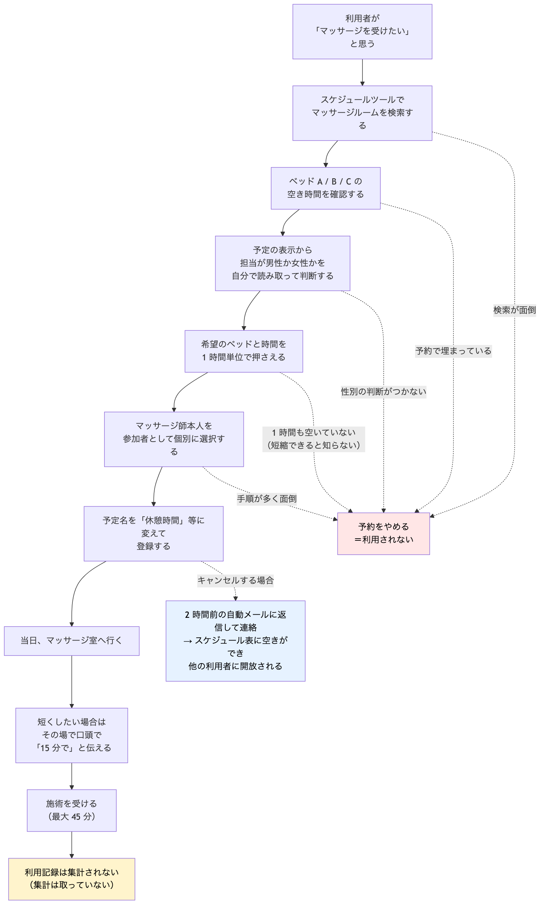
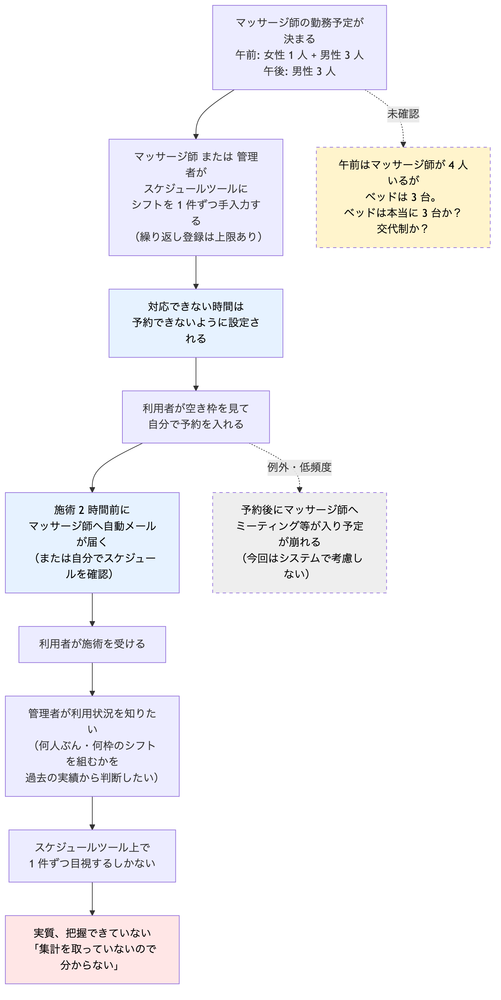

# Requirements

情報源:

- 2026-09-08 利用者ヒアリング（福利厚生／マッサージ室の管理側 1 名）の文字起こし
- 2026-09-08 As-Is 図のレビュー（利用者側 9 点 / 管理者側 6.5 点、指摘反映済み）
- 2026-09-08 第 2 回ヒアリング（`docs/intern/hearing-2.md` に回答を記録）

本ファイルは、**実際に語られた内容**と、**まだ確認できていない内容（※未確認）**を区別して書く。推測で埋めない。

## 用語（登場人物は 3 つに統一する）

このプロジェクトの登場人物は次の 3 つだけ。以降、他の呼び方（社員、担当者、施術者、ユーザー）は使わない。

| 用語 | 指すもの |
|---|---|
| **利用者** | マッサージを受ける社員。予約を入れるのは常にこの人 |
| **管理者** | 福利厚生を管理する人。利用状況を把握し、シフト量を判断したい |
| **マッサージ師** | 施術する人。自分または管理者がシフトをスケジュールツールに登録する |

## 背景と目的

### きっかけ

社内の福利厚生としてマッサージ室（施術ベッド 3 台）を提供しているが、**あまり利用されていないように感じている**。

- 管理側の担当者自身、在籍 20 数年で利用は **2 回だけ**。
- 「めちゃくちゃ使っている人」もいる一方で、「全く使ったことがない」「使えていない」という人もいると考えている。
- ただし、実際に誰がどれだけ使っているかを示すデータは**存在しない**。つまり現状は**体感ベースの問題提起**である。

### 作らなかった場合に困り続ける人と困りごと

| 誰 | 困りごと |
|---|---|
| まだ使ったことがない利用者 | 予約手順が煩雑で、受けたいと思っても手前で諦める。福利厚生があるのに受益できない |
| 短時間だけ空いている利用者 | 「必ず 1 時間押さえる」ルールに見えるため、30 分しか空いていないと最初から対象外だと思ってしまう（実際は 15 分・30 分でも受けられる） |
| 新卒・入社間もない利用者 | 上記の「15 分でもよい」という運用ルールがどこにも共有されておらず、そもそも知らないまま利用しない |
| 管理者 | 利用実績を数値化できず、「利用率が低い」という仮説を検証できない。**シフトを何人ぶん・何枠組むべきかも過去の実績から判断できない** |
| マッサージ師 / 管理者 | シフト登録の繰り返し設定に上限（60 日など）があり、基本は 1 件ずつ手入力し続けている |

### 目的（誰の何が、どう変わるか）

**（案・ヒアリング相手の確認待ち）**

1. **利用者**: 「受けたい」と思ってから予約を終えるまでの手間と迷い（部屋の検索・担当の性別判断・マッサージ師の個別指名・1 時間縛りの誤解）がなくなり、**これまで一度も使ったことがなかった人が、空いた時間に受けに行けるようになる**。
2. **管理者**: 誰が・いつ・どのベッドで・何回使ったかが**数字で見える**ようになり、体感でしかなかった「利用率が低い」を検証でき、**シフトをどれだけ組むべきかも実績から判断できる**ようになる。

**重要な優先順位（ヒアリングで明言あり）**

> 「リピーターは二の次。できるだけ**いろんな人に使ってもらいたい**」

理由: ベッド数（3 台）と時間に限りがあるため、同じ人の利用回数を増やすことは目的ではない。
→ 目指す指標は「延べ利用回数」ではなく **利用したことがある人の割合（ユニーク利用者数）** である。

### 現状の解決手段（今はどうしているか）

社内の**スケジュール設定ツール**（会議の予定調整・会議室の予約に使っているもの）の一機能として運用している。専用の仕組みは存在しない。

- **シフトの登録**: マッサージ師の勤務予定が決まると、**マッサージ師または管理者**がスケジュールツールへ 1 件ずつ手入力する。
- **予約の登録**: **利用者が自分で**空き枠を見て予約を入れる。

現状ルール・実態:

| 項目 | 内容 |
|---|---|
| 施術時間 | **最大 45 分** |
| 予約枠 | **必ず 1 時間**で押さえる（清掃・準備の時間を確保するため） |
| 短縮利用 | 利用者の都合で 30 分・15 分でも受けられる。**その場で口頭で伝える**運用。※ルールとして共有されておらず、知らない人がいる |
| ベッド | マッサージ室は扉 1 つ、中に**ベッド 3 台（A / B / C）** |
| 担当 | ベッドとマッサージ師は**固定ではない**。休みなどで入れ替わる |
| マッサージ師の性別 | 男性・女性がいる。**利用者が予定表から自分で読み取って判断**している |
| 指名 | ベッドを押さえるだけでなく、**マッサージ師本人を参加者として個別に選択**する必要がある |
| 予定の名前 | 「マッサージ」とは書かず「休憩時間」などにして登録している人がいる |
| 予約タイミング | 昼休憩以外の業務時間は各自の裁量。**当日・直前の予約もあり得る**（空いていれば行ける） |
| 予約が埋まっていたら | **諦める**（現状はキャンセル待ちなどの仕組みはない） |
| キャンセル | **発生する**。 自動メールの返信でキャンセルの連絡を入れる。スケジュール表に空きができ開放される |
| シフト登録 | 繰り返し登録に上限（60 日など）があり、**基本は 1 件ずつ手入力** |
| 利用実績 | スケジュールツールから **CSV 等でエクスポートできない**。集計するには 1 件ずつ目視するしかない |

管理側の困りごと（原文の要点）:

> 「何も数値化ができていない。誰がどれだけ使っているのかも、誰が施術したかも分からない」
> 「ベッドは基本みんな上（A）に行く」（＝ベッドごとの偏りがあるが把握できていない）
> 「管理したいけどできていない」
> 「どの時間帯の利用が多いかが見られるようになったら、管理者としてはうれしい」

**レビューで補足された点**: CSV で出せないこと自体が問題なのではない。**CSV を出す必要があるかは別の話**であり、
「1 件ずつ目視するしかない」状態を、**Web アプリケーション上で見やすく管理できれば解決する**可能性がある。

## 利用者と関係者

| 区分 | 誰 | 人数・規模 |
|---|---|---|
| 使う人 | 利用者（マッサージを受ける社員）。既利用者と未利用者に分かれる | 全社員700名|
| 運用・管理する人 | 管理者（利用状況の把握、シフト量の判断）。シフト登録はマッサージ師または管理者 | シフトは無く、固定で　9:00~14:00　15:00~19:00でマッサージルームは運営されている。休む人が出た際に調整 |
| 結果を受け取る人 | 管理者（利用実績データ）／マッサージ師（自分の予約状況） | マッサージ師 |
| 施術する人 | マッサージ師（男性・女性がいる。ベッド担当は固定でない） | 午前中：女性1人、男性3人　午後：男性3人 |

同時施術可能人数は**ベッド 3 台ぶん**で確定。対象は **約 700 人**。

### 規模の試算（700 人 × ベッド 3 台）

稼働時間は **9:00〜14:00 と 15:00〜19:00 の計 9 時間**（14:00〜15:00 は休憩）。

| 施術時間 | 押さえる枠 | 1 日の枠数（3 台 × 9 時間） | 700 人が 1 回ずつ受けるのに必要な稼働日数 |
|---|---|---|---|
| 45 分 | 60 分 | 27 枠 | 約 26 日（約 1 か月半） |
| 30 分 | 45 分 | 36 枠 | 約 20 日 |
| 15 分 | 30 分 | 54 枠 | 約 13 日 |

読み取れること:

- **「700 人全員が年に数回受ける」程度なら供給は足りている。** 予約の手間を減らせば利用者は増やせる。
- **「全員が毎月受ける」は物理的に不可能。** ベッド 3 台が上限になる。
- したがって目的の「いろんな人に使ってもらいたい」は、**供給を増やす話ではなく、偏りを減らす話**である。
- **1 日あたりの実際の利用件数は「集計を取っていないので分からない」（Q-4）。**
  つまり「予約の手間が問題なのか、枠が足りないのか」は**現時点では判定できない**。
  これは作ろうとしているシステムが解決する対象そのものであり、**まず測れるようにすることが最初の価値になる**。

### 未解決の論点（要確認）

| # | 論点 | なぜ重要か |
|---|---|---|
| ~~R-1~~ | ~~**午前はマッサージ師が 4 人いるが、ベッドは 3 台**。ベッドは本当に 3 台か~~ → **2026-09-09 決着。マッサージ室は 1 つで、管理の単位は「ベッド数」。台数はマスタで可変にして管理者が変更できる**（AC-10） | 同時施術可能数はベッド数で決まる。データ構造（ベッドとマッサージ師の関係）の前提が変わる |
| R-2 | **午後は女性マッサージ師がいない**（男性 3 人のみ） | 「女性に施術してもらいたい」利用者は午前しか予約できない。AC-4（性別表示）の重要度が上がり、性別で絞り込む機能の価値が高い |
| R-3 | 1 日あたりの利用件数、埋まって取れない頻度（Q-4） | 供給不足か手間かの判定。ただし現状は測る手段がない |

## 現状の業務の流れ（As-Is）

図の正本は `as-is-user.mmd` / `as-is-admin.mmd`。画像は下記を参照（再生成方法は `as-is.md` 末尾）。

### 利用者側（レビュー結果: 9 点 / 10 点）

~~~mermaid
flowchart TD
  A["利用者が 「マッサージを受けたい」と思う"] --> B["スケジュールツールで マッサージルームを検索する"]
  B --> C["ベッド A / B / C の 空き時間を確認する"]
  C --> D["予定の表示から 担当が男性か女性かを 自分で読み取って判断する"]
  D --> E["希望のベッドと時間を 1 時間単位で押さえる"]
  E --> F["マッサージ師本人を 参加者として個別に選択する"]
  F --> G["予定名を「休憩時間」等に変えて 登録する"]
  G --> H["当日、マッサージ室へ行く"]
  H --> I["短くしたい場合は その場で口頭で 「15 分で」と伝える"]
  I --> J["施術を受ける （最大 45 分）"]
  J --> K["利用記録は集計されない （集計は取っていない）"]

  B -.->|"検索が面倒"| X["予約をやめる ＝利用されない"]
  C -.->|"予約で埋まっている"| X
  D -.->|"性別の判断がつかない"| X
  E -.->|"1 時間も空いていない （短縮できると知らない）"| X
  F -.->|"手順が多く面倒"| X

  G -.->|"キャンセルする場合"| C1["2 時間前の自動メールに返信して連絡 → スケジュール表に空きができ 他の利用者に開放される"]

  style X fill:#ffe6e6,color:#000000
  style K fill:#fff4cc,color:#000000
  style C1 fill:#e6f2ff,color:#000000
~~~

**第 2 回ヒアリングで判明**: キャンセルは「施術 2 時間前の自動メールに返信して連絡」→ スケジュール表に空きができ、他の利用者へ開放される（青いボックス）。

### 管理者・マッサージ師側（レビュー結果: 6.5 点 / 10 点）

~~~mermaid
flowchart TD
  S1["マッサージ師の勤務予定が決まる 午前: 女性 1 人 + 男性 3 人 午後: 男性 3 人"] --> S2["マッサージ師 または 管理者が スケジュールツールに シフトを 1 件ずつ手入力する （繰り返し登録は上限あり）"]
  S2 --> S3["対応できない時間は 予約できないように設定される"]
  S3 --> U1["利用者が空き枠を見て 自分で予約を入れる"]
  U1 --> N1["施術 2 時間前に マッサージ師へ自動メールが届く （または自分でスケジュールを確認）"]
  N1 --> U2["利用者が施術を受ける"]

  U2 --> A1["管理者が利用状況を知りたい （何人ぶん・何枠のシフトを組むかを 過去の実績から判断したい）"]
  A1 --> A2["スケジュールツール上で 1 件ずつ目視するしかない"]
  A2 --> A3["実質、把握できていない 「集計を取っていないので分からない」"]

  U1 -.->|"例外・低頻度"| R1["予約後にマッサージ師へ ミーティング等が入り予定が崩れる （今回はシステムで考慮しない）"]

  S1 -.->|"未確認"| Q1["午前はマッサージ師が 4 人いるが ベッドは 3 台。 ベッドは本当に 3 台か？ 交代制か？"]

  style A3 fill:#ffe6e6,color:#000000
  style R1 fill:#eeeeee,color:#000000,stroke-dasharray: 5 5
  style Q1 fill:#fff4cc,color:#000000,stroke-dasharray: 5 5
  style S3 fill:#e6f2ff,color:#000000
  style N1 fill:#e6f2ff,color:#000000
~~~

**反映した指摘（6.5 点の理由）**:

| 指摘 | 修正内容 |
|---|---|
| 「担当者が 1 件ずつ入力する」は誤り。予約を入れるのは利用者 | シフト登録（マッサージ師 or 管理者）と、予約登録（利用者）を分けた |
| 「担当者」という呼び方が曖昧 | 登場人物を利用者 / 管理者 / マッサージ師の 3 つに統一 |
| 「マッサージ師にミーティングが入る」は例外ケース。システムで考慮不要 | 例外・低頻度として点線に降格。位置も「予約後」に修正（予約が無ければ崩れない） |
| 管理者が実績を見たい理由 | 「シフトを何人ぶん・何枠組むか」の判断材料であることを明記 |
| CSV で出せないこと自体は本質ではない | 「1 件ずつ目視するしかない」を課題として残し、CSV は手段の 1 つとして扱う |

## 入力と出力

| 種類 | 内容 | 出どころ / 行き先 |
|---|---|---|
| 入力 | 希望日時（当日・直前もあり） | 利用者 |
| 入力 | 希望する施術時間（15 / 30 / 45 分） | 利用者 |
| 入力 | マッサージ師の性別の希望、または指名 | 利用者 |
| 入力 | マッサージ師のシフト（勤務・対応可能時間） | マッサージ師 または 管理者 |
| 入力 | ベッド（A / B / C）の空き状況 | 現行のスケジュールツール |
| 出力 | 予約の確定内容（日時・ベッド・マッサージ師・施術時間） | 利用者、マッサージ師 |
| 出力 | 利用実績（誰が・いつ・どのベッド・どのマッサージ師・何分） | 管理者 |
| 出力 | 集計ビュー（時間帯別の利用、ベッド別の偏り、ユニーク利用者数） | 管理者 |
| 出力 | 運用ルールの明示（1 時間枠だが 15 分から利用可、など） | 利用者（特に新入社員） |

サンプルデータ: `docs/intern/data/`（**未取得**）
→ 次回ヒアリングで依頼するもの: 現行スケジュールツールの予約画面の様子、マッサージ師のシフト表の形式。
**実データをそのまま置かない。氏名・予約履歴は個人情報のため、仮名化したサンプルに置き換えて扱う。**

## 非機能要件

| 項目 | 内容 |
|---|---|
| 利用者数（同時 / 全体） | 同時施術は**最大 3 人**（ベッド 3 台）で確定。全体の対象人数は 700人 |
| データ量（1 日 / 累計 / 保存期間） | 1 日の予約枠数の上限は **27〜54 枠**（施術時間による）。実際の件数は集計されておらず不明。保存期間は ※未確認 |
| 利用端末と場所 | ※PC。現状は業務用 PC のスケジュールツール上 |
| 利用時間帯とピーク | 施術は業務時間内。昼休憩以外の時間も各自の裁量で取得可能。**ピーク時間帯は管理者も把握できていない**（把握したい対象そのもの） |
| マッサージ室の稼働時間 | **9:00〜14:00 と 15:00〜19:00 の計 9 時間**（14:00〜15:00 は休憩） |
| 外部送信 | 予約確定時にマッサージ師へメール、施術 15 分前に利用者へ Slack・マッサージ師へメールを自動送信する（AC-11 / AC-12） |
| 認証と権限 | **利用者 / 管理者 / マッサージ師**の 3 権限。管理者は**個人単位で利用実績を閲覧してよい**（Q-7 で確認済み。理由「より多くの人に使ってもらいたいから」） |
| 扱ってはいけない情報 | 本番情報、秘密情報、個人情報、社内機密は扱わない。開発では仮想データのみ使う。※「誰がいつ受けたか」の個人単位閲覧は管理者に許可されている（Q-7） |
| 止まったときの影響と復旧時間 | 管理者がSlackで対応 |
| 運用者 | 管理者 |

## 作るものの種類

**Web アプリケーション（現行スケジュールツールとは別の、独立した新規アプリとして作る）**

Q-5 の回答: 「今回は**別アプリとして作成する**」。現行ツールとの連携・データ移行は行わない。

主目的「予約と記録を一本で通す」を満たすには、利用者・管理者・マッサージ師の 3 者が
同じ予約データを読み書きする必要があるため、Web アプリが最も素直な形になる。

レビューでの発言:

> 「1 件ずつ目視するしかないっていうのは今の問題としてあるけど、それを **Web アプリケーションで見やすく管理できれば良さそう**」

この種類を選ぶ理由: 利用者・管理者・マッサージ師の 3 者が同じ予約データを読み書きする必要があり、
利用端末は業務用 PC（Q-6）で、現状も PC のブラウザ上のツールで完結しているため。
別アプリとして独立させることで、現行ツールからデータを取り出す課題を回避し、予約データがそのまま実績として貯まる。

他の候補: スマホアプリ / AI エージェント / チャットボット / バッチシステム / シンプルなホームページ

## 主目的（2026-09-08 決定）

**予約と記録を一本で通す。**
利用者が新しい仕組みで予約する → その予約データがそのまま利用実績になる → 管理者が画面で見る。

この構成を選ぶ理由: 予約体験の改善と利用状況の可視化を別々に作らずに済む。
実績は予約の副産物として自動で貯まるため、現行スケジュールツールからデータを取り出す課題（Q-5）を回避できる。

前提となるリスク: 利用者とマッサージ師が**新しい仕組みで予約・シフト登録をしてくれること**。
現行ツールを使い続けるなら実績は貯まらない。→ Q-5 / Q-8 で必ず確認する。

## 予約枠のルール（To-Be・2026-09-08 決定）

現行の「必ず 1 時間押さえる」を改め、**押さえる枠 = 施術時間 + 15 分**とする。
+15 分は清掃・準備の時間。

| 施術時間 | 押さえる枠 |
|---|---|
| 15 分 | 30 分 |
| 30 分 | 45 分 |
| 45 分 | 60 分 |

これにより、短い空き時間しかない利用者も予約できるようになる（現状の「1 時間縛りの誤解」の解消）。

## 受け入れ基準（確定）

各基準は「誰が / 何をすると / どうなる」で書く。優先は 必須 = MVP に入れる、後 = 今回は入れない候補。

### 管理者による優先順位（2026-09-08 確認済み・P-1）

| 質問 | 回答 |
|---|---|
| 一番いらないもの | **なし**（12 件すべて必要） |
| 足すもの | **なし** |
| 全部できたら何点の成功か | **10 点 / 10 点** |
| **3 つしか作れないなら、どれを残すか** | **AC-1 / AC-2 / AC-8** |

この 3 件を **コア** と呼ぶ。`/design` で MVP の範囲を決める際は、**コアから外側へ広げる**順で組み立てる。

| コア | 内容 | 意味 |
|---|---|---|
| AC-1 | 利用者が空き枠を一覧で見られる | 「探せない」を解消する |
| AC-2 | 空き枠を 1 つ選ぶだけで予約が完了する | 「面倒でやめる」を解消する |
| AC-8 | 管理者がベッド別・時間帯別の予約状況を見られる | 「1 件ずつ目視するしかない」を解消する |

**注目点**: 管理者は集計（AC-6 / AC-7）よりも**今どこが埋まっているかが見える画面（AC-8）**を選んだ。
「まず現状が一目で見えること」のほうが優先度が高いと読める。集計は次段階。

### 利用者向け

| # | 誰が | 何をすると | どうなる | 優先 | 対応する困りごと |
|---|---|---|---|---|---|
| AC-1 | 利用者 | 予約画面を開く | 空いている枠が一覧で見える（部屋を検索しなくてよい） | **必須（コア）** | 検索が面倒 |
| AC-2 | 利用者 | 空き枠を 1 つ選んで確定する | 予約が完了する。マッサージ師を個別に指名する操作は不要 | **必須（コア）** | 手順が多く面倒 |
| AC-3 | 利用者 | 施術時間を 15 / 30 / 45 分から選ぶ | **施術時間 + 15 分**の枠が押さえられる。1 時間押さえる必要がないと画面上で分かる | 必須 | 1 時間縛りの誤解 |
| AC-4 | 利用者 | 空き枠の一覧を見る | 各枠のマッサージ師の性別が表示され、自分で読み取らなくてよい | 必須 | 性別の判断がつかない |
| AC-5 | 利用者 | 案内（利用ガイド）を開く | マッサージ室の利用ルールがまとめて確認できる。施術時間は 15 / 30 / 45 分から選べること、利用可能時間帯、場所、ベッド数などを 1 か所で読める | 必須 | ルールが共有されておらず、知らない人が使わない |

**AC-5 の補足**: モーダル（画面に重ねて出る小窓）でもページでもよい。表示方法は Design で決める。
この基準は「新卒が 1 時間必須だと思い込んで使わない」という困りごとに直接効く。

### 管理者向け

| # | 誰が | 何をすると | どうなる | 優先 | 対応する困りごと |
|---|---|---|---|---|---|
| AC-6 | 管理者 | 集計画面で期間を指定する | その期間に**利用した人が何人いるか**（ユニーク利用者数）が見える。**個人単位でも確認できる**（Q-7 で許可） | 必須 | 数値化できていない／目的の指標そのもの |
| AC-7 | 管理者 | 集計画面を見る | 時間帯別・ベッド別の利用件数が見える | 必須 | ピークが分からない／ベッドの偏りが分からない |
| AC-8 | 管理者 | 予約状況画面を見る | どのベッドの、どの時間帯に予約が入っているかが一覧で分かる | **必須（コア）** | 1 件ずつ目視するしかない |
| AC-9 | **マッサージ師**（管理者も代行可） | 自分のシフトを登録・変更する | 勤務可能な時間帯が登録され、利用者の空き枠に反映される | 必須 | シフト登録の手間。Q-8「基本的にはマッサージ師に入力してもらう。管理者が入れることもできる」 |
| AC-10 | 管理者 | マスタを編集する | ベッドの追加、マッサージ師の追加・変更ができる | 必須 | 体制変更に対応できない |

管理者は利用者向け画面も使える（自分も利用者であるため）。権限の設計は Design で決める。

### 通知

| # | 誰が | 何をすると | どうなる | 優先 | 対応する困りごと |
|---|---|---|---|---|---|
| ~~AC-11~~ | 利用者 | 予約を確定する | **即座にマッサージ師へメールが自動送信される** | 必須 | マッサージ師が予約を把握する手段が不明（As-Is の Q-10）。**宛先・手段を 2026-09-10 に変更、下記「2026-09-10 の変更」を参照** |
| AC-12 | （システム） | 施術開始の 15 分前になる | **利用者へは Slack、マッサージ師へはメール**で通知が自動送信される | 必須 | 予約を忘れる／来ないことへの対策 |

通知手段は確定（2026-09-08 決定）。**現行は「施術 2 時間前にマッサージ師へ自動メール」**なので、
AC-11（予約時に即座）と AC-12（15 分前）は現行より手厚くなる。

| 通知 | 宛先 | 手段 |
|---|---|---|
| 予約確定時／キャンセル時（AC-11 / AC-18） | マッサージ師 | ~~メール~~ → **Slack DM**（2026-09-10 変更） |
| 施術 15 分前（AC-12） | 利用者 | **Slack** |
| 施術 15 分前（AC-12） | マッサージ師 | メール |

検討しないと決めた点（2026-09-08 判断）:

- メールアドレスを保持することの個人情報上の扱い
- 開発環境から社内メールを送れるかどうか

### 後回し候補

| # | 誰が | 何をすると | どうなる | 優先 | 備考 |
|---|---|---|---|---|---|
| ~~AC-13~~ | 利用者 | 予約をキャンセルする | その枠が他の利用者に空き枠として表示される | **必須に格上げ（2026-09-09）** | 下記「2026-09-09 の変更」を参照 |
| AC-14 | 管理者 | シフトを繰り返し設定で登録する | 1 件ずつ手入力しなくてよい | 後 | AC-9 が入れば手入力自体は現行より楽になる |
| ~~AC-15~~ | マッサージ師 | 自分の予約状況を画面で見る | 誰がいつ予約したかが分かる | **必須に格上げ（2026-09-09）** | 学生の画面案に含まれた |

## 2026-09-09 の変更（学生の画面案レビューで決定）

学生が全体の画面構成を提示し、テックリードがレビューして抜けを指摘した結果、次を決定した。
実装体制が **3 人 + AI での分担**になったため、MVP から外していた基準を戻している。

### 追加した受け入れ基準

| # | 誰が | 何をすると | どうなる | 優先 |
|---|---|---|---|---|
| **AC-16** | 利用者 / マッサージ師 / 管理者 | ログインする | 自分の権限で見える画面だけが表示される。**予約に社員が一意に紐づく** | 必須 |
| **AC-17** | 管理者 | ユーザー管理画面を開く | 利用者・マッサージ師・管理者のアカウントを追加・変更・無効化でき、権限とマッサージ師の性別を設定できる | 必須 |

**AC-16 を追加した最大の理由は認証そのものではなく、集計の精度**である。
現行 PoC は予約時に名前を手入力しており、「中山」「なかやま」が別人として数えられるため
**AC-6 のユニーク利用者数（＝このプロジェクトの目的の指標）が測れない**。
ログインによって予約が社員 ID に紐づき、はじめて AC-6 が意味を持つ。
AC-17 は「700 人ぶんのアカウントをどう用意するか」という AC-16 の副作用に対応するもの。

### 変更した受け入れ基準

| # | 変更前 | 変更後 | 理由 |
|---|---|---|---|
| AC-9 | **マッサージ師**が自分のシフトを登録・変更する（管理者も代行可） | **シフト表そのものを廃止。**基本の出勤曜日・勤務時間（**平日 9:00〜14:00・15:00〜20:00**）は全員共通の固定値としてアプリ側で持つ。**「午前中しか働けない」など既定と違う曜日・時間で働く人だけ**、管理者がその人の曜日ごとの勤務時間を個別に登録できる。加えて**管理者は「急な欠勤」を登録する**。欠勤を登録すると、重なる予約は自動キャンセルされ対象の利用者へ通知される（AC-13 の仕組みを流用） | 学生の判断「マッサージ師が自由に変更できるとやりたい放題になる」に加え、**実際の運用が「シフトは無く固定時間で運営、休む人が出た時だけ調整」**（本ドキュメントの現状把握セクション）だったため、日々のシフト入力という手間自体をなくした。**ただし全員が同じ曜日・時間で働くわけではない**ため、例外だけ個別に登録できるようにした |
| AC-10 | ベッドの追加、マッサージ師の追加・変更 | **ベッド数の管理**（マッサージ室は 1 つ）。マッサージ師の追加・変更は AC-17 のユーザー管理へ移す | R-1 決着。部屋ではなくベッド数が管理の単位 |
| AC-13 | 利用者がキャンセルする（優先: 後） | **利用者と管理者の両方**がキャンセルできる（優先: 必須）。管理者のキャンセルは**マッサージ師の急な休み**などを想定し、対象の利用者へ通知する | 現行運用でもキャンセルは発生している。管理者経由のみにすると現状より手間が増えるため、本人のキャンセルを必ず残す |

### 実装体制の変更

| 項目 | 変更前 | 変更後 |
|---|---|---|
| 体制 | 学生 1 人 | **3 人で分担 + AI を利用** |
| 範囲 | PoC は AC-1〜AC-5 / AC-8 の 6 件 | **必須 14 件すべてに挑戦する**（AC-14 のみ「後」のまま） |

学生の判断: 「3 人で分担して AI を使うので、絞らずに一旦作ってみる」。
テックリードの補足: 並行開発になるため、**設計（画面・権限・データ構造・ファイル分割）を先に確定させる**。
確定していないと 3 人が同じファイルを取り合って手が止まる。

### 目的との対応

AC-6 と AC-7 は、**「いろんな人に使ってもらいたい」という目的を測る指標**そのもの。
特に AC-6 は「延べ回数」ではなく「人数」で数えることが、目的（リピーターより裾野）に直結する。

AC-1〜AC-5 は「使われない理由」を 1 つずつ潰す基準。
AC-8〜AC-10 は「管理したいけどできていない」を解消する基準。

### 規模に関する注意（テックリードからの指摘）

必須の受け入れ基準が **12 件**になった。インターン期間で全部を作り切れるかは、Design で必ず検証する。
特に AC-9 / AC-10（管理画面とマスタ管理）と AC-11 / AC-12（通知）は、
画面数・実装量ともに大きくなりやすい。

要件としてはこのまま残す。**削るかどうかの判断は `/design` の MVP 範囲を決める工程で行う**。
要件段階で削ってしまうと「何を諦めたのか」が記録に残らないため、ここでは残すのが正しい。

## 2026-09-10 の変更（マッサージ師向け通知を Slack DM に変更）

中山さんの判断: 「疑似送信（実際には送らない）では、マッサージ師が予約を把握できたか確認できない。
Slack で実際に DM を送りたい」。ワークスペースに Bot（`RefreshHub-notification`）を作成し、実現可能と確認した。

### 追加した受け入れ基準

| # | 誰が | 何をすると | どうなる | 優先 |
|---|---|---|---|---|
| **AC-18** | 利用者 / 管理者 | 予約をキャンセルする（AC-13） | **担当だったマッサージ師へ Slack DM で通知される**（キャンセルした本人が利用者・管理者のどちらでも） | 必須 |

**AC-18 を追加した理由**: 元の AC-13 は「管理者経由のキャンセル時に利用者へ通知する」までしか決めておらず、
マッサージ師への通知は範囲外だった。AC-11（予約確定時にマッサージ師へ通知）と対になる形で、
「担当がキャンセルされたこともマッサージ師が把握できる」ようにする。

### 変更した受け入れ基準

| # | 変更前 | 変更後 | 理由 |
|---|---|---|---|
| AC-11 | 予約確定時、マッサージ師へ**メール**が自動送信される（実際には送信しない疑似送信、design.md D-2） | 予約確定時、マッサージ師へ **Slack DM** が自動送信される（**実際に送信する**。疑似送信をやめる） | マッサージ師が予約を把握できたことを実際に確認できるようにするため |

技術的な決定（Slack User ID の特定方法、送信失敗時の扱い、開発中のテスト方針など）は `docs/intern/design.md` の
「D-2 の改訂（2026-09-10）」に記録した。

### 追加の変更（同日）: AC-12（15分前リマインド）も Slack 実送信に含める

中山さんの追加判断: 「AC-11 / AC-18 と同じように、施術15分前のリマインドも実際に Slack で送りたい。
利用者向けにはキャンセルの導線（リンク）も入れたい」。

| # | 変更前 | 変更後 | 理由 |
|---|---|---|---|
| AC-12 | 施術15分前、**利用者へは Slack、マッサージ師へはメール**で通知（実際には送信しない疑似送信、design.md D-2） | 施術15分前、**利用者・マッサージ師の両方へ Slack DM** で通知する（**実際に送信する**）。利用者向けメッセージには自分の予約を確認・キャンセルできる画面へのリンクを添える | AC-11 / AC-18 と一貫させ、疑似送信をやめる。キャンセル忘れ・来忘れの対策（AC-12 本来の目的）に対して実効性を持たせる |

「15分前になった」を検知する仕組み（外部から叩く API・二重送信の防止など）は `docs/intern/design.md` の
「D-2 の再改訂（2026-09-10）」に記録した。

### さらに追加の変更（同日）: デプロイ先が Vercel（無料プラン）に決定 → AC-12 を「毎朝9時の一括通知」に変更

中山さんの判断: 「デプロイはVercelの無料プランでやる予定。Vercel の Cron は無料プランだと1日1回までしか
使えないので、朝9時にその日予約している人全員へまとめて通知しよう。マッサージ師への通知は1件ずつではなく
1つの通知に情報をまとめよう」。

| # | 変更前 | 変更後 | 理由 |
|---|---|---|---|
| AC-12 | 施術**15分前**に、利用者・マッサージ師それぞれへ Slack DM（予約1件ごとに1通） | **毎朝9時**に、その日予約が入っている利用者・マッサージ師へ Slack DM（**その日の予約をまとめて1通**。マッサージ師は複数の利用者を担当していても1通に集約） | デプロイ先（Vercel 無料プラン）の Cron 実行頻度の制約（1日1回まで）に合わせた。あわせて、1日に複数件あるマッサージ師が予約の件数だけ DM を受け取らずに済むようにした |

技術的な決定（Vercel Cron の設定・ローカルでの自動実行など）は `docs/intern/design.md` の
「D-2 の三度目の改訂（2026-09-10）」に記録した。

## 2026-09-11 の変更: 利用者1人につき週1回までの予約制限

中山さんの判断: 「本番環境（Vercel対応）は後回しにして、1人の利用者が同じ週に何度も予約できてしまう状態を先に直したい」。

### 追加した受け入れ基準

| # | 誰が | 何をすると | どうなる | 優先 |
|---|---|---|---|---|
| **AC-19** | 利用者 | 既にその週（月曜始まり）に予約済みの状態で、別の枠を予約しようとする | **予約できず、エラーメッセージが表示される**。**キャンセル済みの予約はカウントしない**（キャンセルすれば同じ週に予約し直せる） | 必須 |

**AC-19 を追加した理由**: 目的（「リピーターは二の次。いろんな人に使ってもらいたい」）に対して、
同じ人が同じ週に何度も予約できる状態は目的に反する。週1回までに制限することで、限られたベッド数・時間を
より多くの人に行き渡らせる。

## 今回作らないこと

| 外すもの | 理由 |
|---|---|
| 予約後にマッサージ師へ予定が入り施術できなくなるケースへの対応 | レビューで「ほぼ例外ケース。システムとして考慮する必要はない」と明言された |
| CSV エクスポート | 目視集計の解消が目的であり、CSV は手段の 1 つにすぎない。画面上で見やすく管理できれば不要な可能性がある |
| （以降は受け入れ基準の確定後に追記） | |

## AI エージェント / Skill の要否

**現時点では不要**（次回ヒアリング後に再判断する）

理由: 主目的は「空き枠を選んで予約する」「予約データを集計して見せる」であり、
どちらも**手順が確定した処理**で実現できる。AI に任せるべき「毎回同じ基準で人が判断している作業」が今のところ見つかっていない。

再判断する条件: ヒアリングで以下のような要望が出てきた場合。

- 利用者の空き時間や好みから**おすすめの枠を提案**してほしい
- 蓄積した実績から**シフトの組み方を提案**してほしい（管理者の判断を代行する）

## 残る確認事項

第 2 回ヒアリング（`docs/intern/hearing-2.md`）で Q-1〜Q-12 は回答済み。残るのは次の 4 件。

| # | 確認したいこと | なぜ必要か | 誰に |
|---|---|---|---|
| R-1 | 午前はマッサージ師が 4 人いるが、ベッドは 3 台。ベッドは何台あるか。交代制か | 同時施術数とデータ構造の前提 | 管理者 |
| R-2 | 午後に女性マッサージ師がいないのは常にそうか | 性別で絞り込む機能の設計に直結 | 管理者 |
| P-1 | **受け入れ基準 12 件を見てどう思うか**（一番いらないもの / 足すもの / 10 点満点で何点 / 3 つだけ作るならどれ） | MVP の範囲を相手の優先順位で決めるため | 管理者 |
| Q-13 | ベッドやマッサージ師の追加・変更はどのくらいの頻度で起きるか | AC-10（マスタ管理）を MVP に入れるかの判断材料 | 管理者 |

**P-1 が最優先。** 必須 12 件をインターン期間で作り切るのは難しい。
削る判断を「こちらの都合」ではなく「相手が選んだ優先順位」で行うために必要。

### 未取得の資料

- [ ] 現行スケジュールツールの予約画面の様子（氏名は伏せてもらう）
- [ ] マッサージ師のシフト表の形式

別アプリとして作る方針が決まったため、現行ツールの画面は**必須ではない**。
ただしシフト表の形式は AC-9 の設計に効くので、あれば見たい。

## 要件宣言

> 私たちは、**沖縄拠点の社員 約 700 人**が「マッサージ室を使いたいのに、予約の手順が煩雑で手前で諦めてしまう。
> そもそも 15 分から受けられることを知らない」状態を、
> **現行スケジュールツールとは独立した予約 Web アプリ**によって、
> **空き枠を一覧から選ぶだけで予約でき、その予約データがそのまま利用実績として管理者に見える**状態にする。
>
> 成功は、**利用者が部屋の検索もマッサージ師の個別指名もせずに予約でき（AC-1〜AC-4）、
> 利用ルールを 1 か所で確認でき（AC-5）、
> 管理者が期間を指定してユニーク利用者数・時間帯別・ベッド別の利用状況を確認できること（AC-6〜AC-8）**で判断する。
>
> 規模は、**利用者 約 700 人、ベッド 3 台、稼働 9:00〜14:00 と 15:00〜19:00 の計 9 時間、
> 1 日の予約枠上限 27〜54 枠**を前提とする。

補足: 現状「1 日に何件利用があるか」は集計されておらず不明（Q-4）。
そのため「予約の手間が問題なのか、枠が足りないのか」は現時点では判定できない。
**まず測れるようにすること自体が、このシステムの最初の価値**である。

### 引き継ぐ未確認事項（Design で扱う）

| # | 内容 | 扱い |
|---|---|---|
| R-1 | 午前はマッサージ師 4 人だがベッドは 3 台。ベッドは何台か | データ構造では**ベッド数を可変**にして設計し、確認が取れ次第データで調整する |
| R-2 | 午後に女性マッサージ師がいないのは常にそうか | シフトデータで表現できるため設計上の障害にはならない |
| Q-13 | ベッド・マッサージ師の追加変更の頻度 | AC-10（マスタ管理）を MVP に入れるかの判断材料。未確認なら後回し扱い |

（形式: 私たちは（利用者）の（現状の困りごと）を、（作るもの）によって（変化）にする。成功は（受け入れ基準の要点）で判断する。規模は（数字）を前提とする。）

確認: 学生 [x]（2026-09-08） / メンター [ ]
