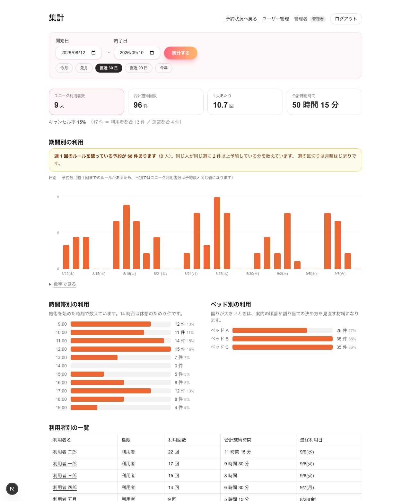

# Tasks

プロジェクト: `massage-booking/`（Next.js 16.3.4 / TypeScript / Tailwind / SQLite + Prisma）
制約: PoC を 1 時間で作る。

## 次に着手するタスク

**学生によるブラウザでの最終確認。** サーバ側とブラウザ操作の自動確認は完了済み。
`cd massage-booking && npm run dev` → http://localhost:3000/ と http://localhost:3000/admin

そのあと `/review` へ進むか、残り 2 日で AC-6 / AC-7（集計）AC-9（シフト画面）AC-13（キャンセル）を足すかを決める。

## 実装タスク

| # | タスク（1 回の動作確認で終わる粒度） | 対応する受け入れ基準 | 状態 | 確認方法と結果 |
|---|---|---|---|---|
| T-0 | `.gitignore` に DB ファイルを追加し、`.env` / `.env.example` を用意する | — | 確認済み | `git check-ignore` で `prisma/dev.db` `.env` `node_modules` が除外されることを確認 |
| T-1 | Prisma スキーマ（Therapist / Bed / Shift / Reservation）を書き、SQLite に反映する | — | 確認済み | `prisma migrate dev` 実行後、テーブル一覧に 4 つが存在 |
| T-2 | シードデータ（マッサージ師 4 名・ベッド 3 台・シフト）を投入する | AC-9 / AC-10 の代替 | 確認済み | `npx tsx prisma/seed.ts` の出力を記録 |
| T-3 | 空き枠の計算ロジックを書き、自動テストを通す | AC-1 / AC-3 の土台 | 確認済み | `npx tsx --test lib/slots.test.ts` → 12 件すべて pass |
| T-4 | 予約画面に空き枠を表示する | AC-1 / AC-3 / AC-4 | 確認済み | ブラウザ自動操作でスクリーンショットと件数を取得（下記ログ） |
| T-5 | 空き枠を選んで予約を保存する | AC-2 | 確認済み | ブラウザからクリック予約 → DB に保存されることを確認 |
| T-6 | 管理者の予約状況画面（ベッド × 時間のグリッド） | AC-8 | **未確認（画面）** | ビルド成功・ルート生成確認済み。**表示は学生が確認する** |
| T-7 | 利用ガイド（モーダル） | AC-5 | **未確認（画面）** | 実装済み。**ブラウザで開いて確認する** |
| T-8 | 予約画面を週表示に変更（ホワイトボードの図に合わせる） | AC-1 / AC-4 | 確認済み | 下記「T-8」参照 |

状態は 未着手 / 進行中 / 確認済み / 未確認 のいずれか。

## 確認ログ

各タスクの実行コマンドと出力、または画面の状態をここに残す。「動いた」だけの記述は不可。

### T-0 セキュリティ確認

```
$ git check-ignore -v massage-booking/prisma/dev.db massage-booking/.env massage-booking/node_modules
massage-booking/.gitignore:46:prisma/*.db	massage-booking/prisma/dev.db
massage-booking/.gitignore:34:.env*	massage-booking/.env
massage-booking/.gitignore:4:/node_modules	massage-booking/node_modules
```

DB ファイル・`.env`・`node_modules` はすべてコミット対象外。`.env.example` にサンプル値を配置。

### T-1 Prisma スキーマと DB

Prisma 7 は `datasource` に `url` を書けなくなり `prisma.config.ts` とアダプタが必要になるため、
**Prisma 6.19.3 に変更した**。部品が少なく、参照できる資料も 6 系が中心のため。

```
$ npx prisma migrate dev --name init
✔ Generated Prisma Client (v6.19.3)

$ (テーブル一覧)
Bed    Reservation    Shift    Therapist
```

### T-2 シードデータ

```
$ npx tsx prisma/seed.ts
投入完了: マッサージ師 4 名 / ベッド 3 台 / シフト 49 件（7 日ぶん）
```

人名はすべて仮名（施術者 A〜D）。実在の社員名・メールアドレス・社員番号は含まない。
午前は女性 1 名 + 男性 3 名、午後は男性 3 名（要件 Q-3 に一致）。

### T-3 空き枠の計算ロジック

```
$ npx tsx --test lib/slots.test.ts
# tests 12
# pass 12
# fail 0
```

テストが証明していること:

| 施術時間 | 押さえる枠 | 9:00〜10:00 の勤務で予約できる開始時刻 |
|---|---|---|
| 45 分 | 60 分 | 9:00 のみ |
| 30 分 | 45 分 | 9:00 / 9:15 |
| 15 分 | 30 分 | 9:00 / 9:15 / 9:30 |

そのほか: 予約済みの枠が除外されること、施術者が 2 人いれば 1 人埋まっていても枠が残ること、
ベッドが全部埋まっていれば枠が出ないこと、勤務時間をはみ出す枠を出さないこと。

### T-4 / T-5 サーバ側の動作確認

一時スクリプトで画面と同じロジックを通した結果（確認後スクリプトは削除済み）。

```
対象日: 2026-09-08
  施術 15 分 → 空き枠 34 件 / 最初=09:00 最後=18:30
  施術 30 分 → 空き枠 32 件 / 最初=09:00 最後=18:15
  施術 45 分 → 空き枠 30 件 / 最初=09:00 最後=18:00

保存直前の空き確認: true
保存しました: 09:00〜10:00 / ベッド A
同じ時刻・同じベッドがまだ出てくるか: false（false なら正しい）

DB の予約件数: 1
  09:00〜10:00 / ベッド A / 施術者 A / 動作確認 太郎 / 施術 45 分
```

**この確認で不具合を 1 件発見し、修正した（下記）。**
確認用に作った予約 2 件は削除済み（`確認用の予約を削除: 2 件`）。

### T-6 管理者画面

```
$ npm run build
✓ Compiled successfully in 1660ms
Route (app)
┌ ○ /
├ ○ /_not-found
└ ƒ /admin
```

型エラー 0。ルートが生成されていることを確認。**画面の見た目は未確認。**

### T-8 予約画面の週表示への変更

学生が持参したホワイトボードの図に合わせ、1 日ぶんのカード一覧から**週表示のスケジュール表**へ変更した。

変更内容:

- 列 = 選んだ日付が含まれる週の月〜金。前週 / 翌週 / 今週で移動
- 行 = 9:00〜19:00 を 15 分刻み
- **ベッド A / B / C の列は作らない。** 1 台でも空いていれば予約可、全部埋まったら灰色で選択不可
- 施術者の性別を**チェックボックス**で複数選択できる
- シードデータを「今日から 7 日」→「今週の月曜から 3 週間ぶんの平日」に変更（週表示だと今週頭のデータが必要なため）

ブラウザ自動操作での確認結果:

```
予約できるマスの数（施術45分・女性+男性）: 120
男性のみに絞ったとき: 120
女性のみに絞ったとき: 68
名前未入力での予約: お名前を入力してください
確認ダイアログ: 9/8(火) 09:00〜10:00 で予約しますか？
予約結果: 2026-09-08 09:00〜10:00 に予約しました（施術 45 分）
```

- **120 マス** = 平日 4 日（9/7 月は過去のため選択不可）× 30 枠。計算どおり。
- **女性のみ 68 マス** = 女性は午前のみ勤務（9:00〜13:00 開始の 17 枠）× 4 日。
  要件の R-2「午後に女性マッサージ師がいない」が画面に表れている。
- 名前が空のときは保存されず、メッセージが出る。

「ベッドが全部埋まったら灰色」の確認（同じ 9:00 の枠を繰り返し予約）:

```
1 回目の予約後: 9/8 09:00 はまだ選べる
2 回目の予約後: 9/8 09:00 は選べない（灰色）
3 回目: 9/8 09:00 はもう選べない（灰色）

$ (DB 確認)
9:00 の予約 3 件（ベッドは 3 台）
  2026-09-08 ベッド A / 施術者 A / テスト 花子
  2026-09-08 ベッド B / 施術者 B / テスト 花子
  2026-09-08 ベッド C / 施術者 C / テスト 花子
```

ベッド A → B → C の順に自動で割り当てられ、3 台すべて埋まった時点で灰色になった。仕様どおり。
確認用の予約 3 件は削除済み。スクリーンショットは `docs/intern/screens/booking-week.png`。

自動テストは 12 件 → **14 件**に増やした（性別の複数選択に対応するテストを追加）。すべて pass。

### 発見して修正した不具合

| 内容 | 空き枠を作るとき「最初に空いている施術者」を割り当てていたため、午前は常に施術者 A（女性）が選ばれ、**午前に男性で絞り込むと 0 件**になっていた。男性 3 名が空いているにもかかわらず |
|---|---|
| 影響する受け入れ基準 | AC-4（性別を見て選べる） |
| 原因 | 性別の絞り込みを「サーバから取得した一覧をクライアントで除外する」形にしていた。割り当てが先に確定してしまうため、除外すると候補ごと消える |
| 修正 | 希望する性別を `getAvailableSlots` に渡し、**割り当ての段階で条件を満たす施術者から選ぶ**ようにした |
| 確認 | 修正後: `male: 午前 17 件 / 最初=09:00`、`female: 午前 13 件`。テストも 2 件追加し 12 件すべて pass |

## 仕様変更の記録

| 日付 | 変更内容 | 反映先（requirements / design） | 理由 |
|---|---|---|---|
| 2026-09-08 | データ保存を JSON ファイルから **SQLite + Prisma** に変更 | design.md | 学生の指示「データベースは必ず使用してください」 |
| 2026-09-08 | Prisma 7 → **Prisma 6.19.3** | design.md（技術構成） | Prisma 7 は `datasource` に `url` を書けず `prisma.config.ts` とアダプタ設定が必要。1 時間の PoC には部品が多すぎるため |
| 2026-09-08 | 性別の絞り込みを**サーバ側の割り当て条件**に変更 | design.md（処理の流れ） | クライアント側で除外すると、先に別の性別が割り当てられた時刻が候補ごと消えるため（不具合として発見） |
| 2026-09-08 | 予約画面を**週表示のスケジュール表**に変更。ベッドの列を廃止し、性別はチェックボックスに | design.md（画面遷移図 / API） | 学生が持参したホワイトボードの図に合わせた。週全体の空き具合が一目で分かる |
| 2026-09-08 | シードデータを「今日から 7 日」→「今週の月曜から 3 週間ぶんの平日」に変更 | — | 週表示では今週の頭からシフトが無いと表が空になるため |

## 既知のリスク（PoC のため受け入れているもの）

| # | 内容 | 影響 | 対応方針 |
|---|---|---|---|
| RISK-1 | **認証が無い。** `/admin` は URL を知っていれば誰でも開ける | 予約状況（誰がいつ受けるか）が全員に見える | PoC では受け入れる。本番運用には認証が必須。design.md「作らないもの」に記載済み |
| RISK-2 | 予約の排他制御が簡易（保存直前の再確認のみ） | 極めて短い間隔で同じ枠に予約が入ると二重予約の可能性 | 利用者規模（700 人・1 日 27〜54 枠）では実害が出にくい。MVP 後に DB の一意制約で対応 |

## 実装宣言

> **AC-1 / AC-2 / AC-3 / AC-4 / AC-5 / AC-8 を実装した。**
> 予約画面は週表示のスケジュール表（列 = 月〜金、行 = 9:00〜19:00、緑 = 予約可、灰色 = 選択不可）、
> 管理者画面はベッド × 時間のグリッド。データは SQLite の 4 テーブル（Therapist / Bed / Shift / Reservation）。
>
> 確認は、**空き枠の計算ロジックを自動テスト 14 件**、
> **予約の一連の流れをブラウザ自動操作**（性別の絞り込み・入力検証・予約の保存・ベッドが埋まったときの灰色化）で行った。
> `/admin` の表示と利用ガイドの見た目は**学生による目視確認が未了**。
>
> 認証・通知（AC-11 / AC-12）・集計（AC-6 / AC-7）・シフト登録画面（AC-9）・
> マスタ管理（AC-10）・キャンセル（AC-13）は MVP から外している。

確認: 学生 [ ] / メンター [ ]

## メモ

- Next.js 16 は破壊的変更あり。`massage-booking/node_modules/next/dist/docs/` を参照して書く。
- `searchParams` と `params` は **Promise** なので `await` が必要。

---

# 第 2 版: 土台タスク（F-1〜F-9）

ブランチ: `feat/foundation`。implement_plan.md の「2. 土台タスク」に対応する。

| # | タスク | 確認方法・結果 |
|---|---|---|
| F-1 | `schema.prisma` に `User` を追加し、`Reservation.userName` を `userId` に置き換え | `npx prisma migrate dev` 成功。テーブル一覧に `User` あり |
| F-2 | `Reservation` に `status` / `note` / `cancelledById` / `cancelReason` / `createdAt` / `cancelledAt` を追加 | 同上 |
| F-3 | `Shift` を廃止し、`Therapist` から `name` を削除（表示名は `User.name`）。既定の勤務時間は `lib/business-hours.ts` の定数（平日 9:00〜14:00・15:00〜20:00）。`TherapistWorkHours`（曜日ごとの例外）・`TherapistAbsence`（急な欠勤）を新設。`Reservation` の日付・時刻を `startAt`・`endAt`（DateTime）1 本ずつに統合 | `npx prisma migrate dev --name foundation_v2_schema` 成功。マイグレーション: `prisma/migrations/20260909060818_foundation_v2_schema/` |
| F-4 | `Notification` テーブルを追加 | 同上のマイグレーションに含む |
| F-5 | `seed.ts` を書き換え（管理者 1 名・マッサージ師 4 名・利用者 3 名。全員仮名・`@example.com`、共通パスワード）。動作確認用にセラピスト `t2` を月〜金 9:00〜14:00 の「午前のみ」で登録 | `npx tsx prisma/seed.ts` 実行。出力どおりの件数が投入されることを確認 |
| F-6 | ログインの仕組み（`lib/session.ts`：Cookie で `userId` を保持。`login` / `logout` / `getCurrentUser`） | `lib/session.test.ts`（6 件）で、ログイン→取得→ログアウト・誤ったパスワード・存在しないメールを確認。すべて pass |
| F-7 | `app/actions.ts` を `app/actions/booking.ts` に分割（新しいスキーマに合わせて `userId` ベースに書き換え） | `npm run build` 成功。ブラウザで実際に予約 → `/admin` に反映されることを確認（後述） |
| F-8 | 権限チェックの共通関数（`lib/auth.ts`：`requireRole` / `requireLogin`） | `lib/auth.test.ts`（4 件）で、権限が無い・未ログインだと `AuthError` になることを確認。すべて pass |
| F-9 | `lib/slots.ts` に `resolveShiftsForDate` を追加。既定 or `TherapistWorkHours` を候補にし、重なる `TherapistAbsence` を除外する方式に変更 | `lib/slots.test.ts` で新規 6 件を追加（既定パターン・土日は対象外・個別例外・例外があるが該当曜日の行が無い・欠勤で一部が削れる・別日の欠勤は無関係）。**既存の 14 件を含め合計 30 件すべて pass** |

## ブラウザでの確認

`npm run dev` を起動し、実際に操作して確認した。

- `/` で「利用者」を選択（暫定: A-1 のログイン画面が入るまでの橋渡し。`app/actions/booking.ts` の `listActiveUsersForBooking`）→ 空き枠をドラッグ → 予約確定 → 成功メッセージが出る
- `/admin` で、その予約が「利用者名 / 施術者名 / 施術時間」付きで表示される
- `npx tsc --noEmit`・`npm run build`・`npm run lint` すべて成功

## 暫定対応として残っているもの（B-1 で置き換える）

`WeekSchedule.tsx` の「利用者」欄は、ログイン機能（A-1）が無い間の橋渡しとして**利用者を一覧から選ぶ**方式にしている。
ログインが入ったら、B-1 で「ログイン中のユーザーで予約する」（`getCurrentUser()` を使う）に置き換える。

## 実装宣言（第 2 版・土台）

> **F-1〜F-9 をすべて実装した。** スキーマは design.md 第 2 版の ER 図（6 テーブル: User / Therapist / Bed /
> TherapistWorkHours / TherapistAbsence / Reservation。Notification は本タスクでテーブルのみ追加）と一致させた。
> 自動テストは 30 件（既存 14 件 + 新規 16 件）すべて pass、`build` / `lint` / `tsc` も通る。
> 既存の予約画面・管理者画面は、新しいスキーマに合わせた最小限の書き換えで動作を維持した
> （表示名の入力を廃止しユーザー選択に置き換えたのは、ログイン前の暫定対応）。
>
> A（認証） / B（利用者・マッサージ師） / C（管理者）はこの後、着手できる。

確認: 学生 [ ] / メンター [ ]

---

# 第 3 版: `/therapist`（B 担当分の一部）

| # | タスク | 対応する受け入れ基準 | 状態 | 確認方法と結果 |
|---|---|---|---|---|
| B-2 | `/therapist`（本日の予約・詳細モーダル） | AC-15 | 確認済み | ブラウザ自動操作。テスト予約 3 件（15:00 完了 / 18:00 次の施術 / 19:00 予約済み）を投入し、状態ラベルと「次の施術まで 17 分」の表示、詳細モーダル（利用回数・前回日付・管理者への連絡リンク）を確認。確認後、テストデータは削除済み |
| B-3 | `/therapist/shifts`（シフト一覧。読み取り専用） | design.md「`/therapist` の実装内容」参照 | 確認済み | ブラウザ + DOM 座標確認。予約ブロックの高さが施術時間+清掃 15 分に比例すること、チェックボックスで複数マッサージ師の列を同時表示できることを確認 |
| B-4 | `/therapist/absence`（休み申請の送信・履歴） | design.md「`/therapist` の実装内容」参照 | 確認済み | ブラウザ操作。日付・対象を選ぶと重なる予約件数が自動表示され、送信後に履歴へ「申請中」で残ることを確認（ページ再読み込み後も DB に残っていることを確認）。承認画面は未実装 |

スキーマに `AbsenceRequest` を追加（マイグレーション `20260909083522_therapist_pages`）。
`npx tsc --noEmit` / `npm run build` / `npm run lint` すべて成功、既存の自動テスト 30 件も pass。

確認: 学生 [ ] / メンター [ ]

---

# B: 利用者側アクション（B-2 / B-3 / B-5 の土台）

ブランチ: `feat/booking-user-actions`。担当は**利用者側のみ**（マッサージ師側は別担当）。
当初 A（ログイン画面）を別メンバーが並行して作っていたため、
**既存の UI ファイル（`WeekSchedule.tsx` など）には手を入れず、サーバーアクション（バックエンドロジック）だけ**を先に進めた。
A のログイン（PR #6）はマージ済みのため、以降は UI への組み込みも進める。

| # | タスク | 内容 | 確認方法・結果 |
|---|---|---|---|
| B-3 の締切ルール | `lib/cancellation.ts`：`canUserCancel(startAt, now)` | 利用者は施術開始の2時間前まで（design.md D-3） | `lib/cancellation.test.ts`（4件）で境界（ちょうど2時間前・1秒前・1秒後・施術後）を確認。すべて pass |
| B-2 | `app/actions/booking.ts`：`listMyReservations(userId)` | ログイン中の利用者の、これからの予約一覧（`status="booked"` かつ未来のみ）。ベッド名・施術者名は関連から解決 | スクリプトで直接呼び出し、予約1件を正しく返すことを確認 |
| B-3 / B-5 | `app/actions/booking.ts`：`cancelReservation(reservationId, userId)` | 本人の予約のみキャンセル可。締切を過ぎていたら拒否。`status="cancelled"` / `cancelledById` / `cancelledAt` を保存 | スクリプトで確認: 他人がキャンセル→拒否、本人がキャンセル→成功しDBに反映されることを確認 |

**`app/actions/therapist.ts`（`listMyAssignments`, B-6）はこの PR から外した。**
担当が利用者側のみになったため。マッサージ師側の担当が決まったら、そちらで改めて作る
（一度実装・動作確認まで済ませたコードなので、必要なら過去のコミット `853eeb0` から参照できる）。

## 確認方法の補足

`createReservation` と同様、`cancelReservation` は `revalidatePath` を呼ぶため Next.js のリクエスト文脈外（素の `tsx` スクリプト）から呼ぶとエラーになる。
実際の DB 更新（`status` の変更など）は `revalidatePath` の**前**に行われるため、更新結果は別スクリプトで直接 DB を確認して検証した（実際の画面操作では問題なく動く）。

`npx tsc --noEmit` / `npm run build` / `npm run lint` すべて成功。自動テストは 34 件（既存 30 件 + 新規 4 件）すべて pass。

## UI への組み込み（A のログイン（PR #6）マージ後）

| # | 内容 | 状態 |
|---|---|---|
| B-1 | 暫定の一覧選択を廃止し、`getCurrentUser()` でログイン中のユーザーとして予約するように変更。`createReservation` / `listMyReservations` / `cancelReservation` は `userId` をクライアントから受け取らず、`requireLogin()`（`lib/auth.ts`）でセッションから取得する形にした | 完了。ブラウザでログイン→予約→DB確認まで動作確認済み |
| B-2 | 「自分の予約」の表示。`app/MyUpcomingReservations.tsx`（新規）で `/` 予約画面の**上段に埋め込み**。予約が無ければセクションごと非表示 | 完了 |
| B-3 / B-5 | 同コンポーネントにキャンセルボタン + 確認モーダルを実装。`cancelReservation()` を呼び、`cancelledAt` を保存 | 完了。ブラウザでキャンセル→一覧が即座に更新されることを確認 |
| B-4 | 予約確認のモーダル化。備考欄を追加。性別選択は表の上の絞り込みのまま（D-4）で、モーダルには入れていない（Issue #7 は継続検討） | 完了 |
| B-7 | 利用ガイドの文言更新 | 未着手 |

### B-4 とその後の UI 調整

1. まず「日時・施術時間・ベッド・施術者・お名前・備考」を確認して確定するモーダル（`WeekSchedule.tsx`）と、
   確定後の内容確認パネルを実装。
2. 確認パネルは「これはいらない、最初から自分の予約に反映してフラッシュメッセージで知らせたい」という要望を受けて廃止。
   代わりに `createReservation` の結果をそのままフラッシュメッセージとして出し、
   「自分の予約」側は `window` のカスタムイベント（`lib/events.ts` の `RESERVATION_UPDATED_EVENT`）で
   その場で再取得するようにした（ページ再読み込み不要）。
3. フラッシュメッセージは当初インライン表示だったが、「右上に3秒くらい表示して消えるようにしたい」「だんだん消えるようにしたい」
   という要望を経て、右上固定・3秒表示後にCSSアニメーション（`toast-fade`、`app/globals.css`）でフェードアウトする
   トースト表示に変更。同じ表示をキャンセル完了時にも使うため、`app/useFlashMessage.ts`（状態管理フック）と
   `app/FlashToast.tsx`（表示コンポーネント）に共通化し、`MyUpcomingReservations.tsx` のキャンセル完了メッセージにも適用した。
4. 「選択中の内容と確定ボタン」のバー（表の下、常に高さを確保していた欄）が、何も選んでいないときに
   不要な空白として見えてしまう問題があったため、`fixed` で画面下に浮かせる形に変更。
   常時領域を確保する必要が無くなった上、ドラッグ中に表の位置がズレる心配も無くなった。
5. 「自分の予約」の見出しを「マッサージ室の予約」と同じ大きさ（`text-2xl`）に揃えた。

ブラウザでの確認: 予約確定→確認モーダル→送信→トースト表示＆「自分の予約」に即反映、
キャンセル→トースト表示、を一通り確認。`tsc` / `lint` / `build` / テスト34件、すべて成功。
テストで作成した予約データは都度 `npx tsx prisma/seed.ts` で初期状態に戻した。

### 経緯（B-2 の画面構成を 2 回変更した）

1. 最初は `/` の上段に埋め込み
2. 共有された UI モックアップを参考に、独立画面 `/my-reservations`（「これから」「過去」タブ + 状態バッジ）に変更
3. **「同じ画面で見たい」という要望を受けて、再び `/` の上段への埋め込みに戻した。**
   タブは廃止し、「これから」の予約だけを表示する形にシンプル化した

`listMyReservations()` は全件（過去・キャンセル済み含む）を返す実装のまま残しているが、
`MyUpcomingReservations` 側で `isUpcoming` のものだけに絞り込んで使っている
（将来また履歴表示が必要になったときのために、全件取得の実装自体は活かせる）。

**UI テーマ**: 共有されたモックアップに合わせて、予約画面全体をピンク系のグラデーション配色に変更した
（`app/TopNav.tsx` の共通ヘッダー、空き枠グリッドの配色、確定・キャンセルボタンのグラデーションなど）。

design.md の画面一覧を更新（`/my-reservations` を削除し、画面 2（予約画面）に統合。9 枚 + モーダル 3 つ）。

ブラウザでの確認: ログイン→予約→`/` の上段に「自分の予約」がタブ無しで表示→キャンセル→
確認モーダル→確定→一覧から消え、予約が無くなるとセクションごと非表示になることを確認。
`tsc` / `build` / `lint` / テスト34件、すべて成功。

確認: 学生 [ ] / メンター [ ]

---

# A-4 / A-5: 管理者のユーザー管理（アカウント登録）

ブランチ: `feat/sdmin-screen`。implement_plan.md の「3. A の担当」A-4 / A-5 に対応する。
学生の指示: 「管理者がログインすると、予約状況のスケジュール表とは**別に**ユーザー追加のボタンが置かれている。
押すと氏名・権限・メールアドレス・パスワードの入力欄が出て、DB にユーザーとして追加される。
マッサージ師も登録できる。パスワードは自動生成もできる」。

## 実装前に決めたこと（学生の回答）

| # | 論点 | 決定 |
|---|---|---|
| U-1 | ボタンの置き場所 | **`/admin` にボタン + モーダル**。登録済みの一覧は `/admin/users`（画面 7 / A-4） |
| U-2 | 「登録内容をメールで本人に送る」チェック（学生の画面案にあった） | **出さない。**design.md の D-2 で通知は実送信しないと決めているため、送れないチェックは置かない。代わりに**登録直後に初期パスワードを 1 回だけ画面表示**し、管理者が本人へ手渡し／DM で伝える（D-1 の運用どおり） |
| U-3 | 権限が「マッサージ師」のとき | **性別の選択欄を出す。**性別は `User.gender` に持ち、**権限によらず必須**（実装中に `Therapist` から移動 → 必須化。下記「仕様変更」を参照）。マッサージ師の性別は、利用者が予約画面で担当を絞り込むために使う。User と Therapist は 1 つのトランザクションで同時に作る |

## 作ったファイル

| ファイル | 役割 |
|---|---|
| `lib/roles.ts` | 権限・性別の選択肢とラベル。画面と検証の両方から使う（`UserBar.tsx` の重複していたラベル定義もここに寄せた） |
| `lib/generate-password.ts` | 初期パスワードの自動生成（Web Crypto。読み違えやすい `l I 1 O 0` は使わない）と強さの確認 |
| `lib/users.ts` | 登録の中身（検証 + DB 書き込み）。`next/headers` に依存させず、テストから直接呼べるようにした |
| `app/actions/users.ts` | Server Action（`listUsers` / `createUser`）。**権限確認とフォームの読み取りだけ**を担当 |
| `app/admin/AddUserDialog.tsx` | 「ユーザーを追加」ボタンとモーダル（クライアント側） |
| `app/admin/users/page.tsx` | 登録済みユーザーの一覧（A-4） |

## 確認ログ

### 自動テスト

```
$ npx tsx --test lib/*.test.ts
# tests 41
# pass 41
# fail 0
```

既存 30 件 + 新規 11 件（`lib/generate-password.test.ts` 4 件 / `lib/users.test.ts` 7 件）。
新規テストが証明していること:

| 内容 | 確認したこと |
|---|---|
| 利用者を登録 → **そのアカウントでログインできる**（A-5 の完了条件） | `createUserAccount` → `login` が `{ ok: true }` |
| パスワードは平文で保存されない | DB の値 ≠ 平文。`verifyPassword` では照合できる |
| マッサージ師を登録すると `Therapist` も同時に作られる | `role: therapist` / `gender: female` / `active: true` |
| **性別なしのマッサージ師登録は失敗し、User も作られない** | トランザクションの前に弾いている |
| 同じメールアドレスは 2 回登録できない | 2 回目は「すでに登録されています」 |
| 大文字で入力しても小文字で保存され、小文字でログインできる | 表記ゆれでログインできない事故を防ぐ |
| 弱いパスワード・不正なメール・不明な権限を弾く | すべて `ok: false` |

テストで作ったユーザーは後始末で削除済み（実行後の `User` は シードの 8 件のまま）。

### 権限の確認（`curl` で URL 直打ちを再現）

```
未ログインで /admin/users     → 307 /login?next=%2Fadmin%2Fusers
利用者(u1)で /admin/users     → 307 /?denied=admin
管理者で    /admin/users      → 200（「ユーザー管理」「登録済みのアカウント 8 件」が表示）
利用者(u1)で /admin           → 307 /?denied=admin
管理者で    /admin            → 200（「ユーザーの登録」ブロックと「ユーザーを追加」ボタンが表示）
```

画面を隠すだけでなく Server Action 側でも `requireRole(["admin"])` を通している（F-8）。

### ビルド・型・Lint

```
$ npx tsc --noEmit   → エラー 0
$ npm run lint       → エラー 0
$ npm run build      → ✓ / Route: / , /admin , /admin/users , /login
```

### 学生が確認すること（未確認）

**モーダルの操作はブラウザでの確認が必要。** `npm run dev` → 管理者でログイン → http://localhost:3000/admin

1. 「ユーザーを追加」を押すとモーダルが開き、初期パスワードが最初から入っているか
2. 「自動生成」を押すたびに値が変わるか
3. 権限を「マッサージ師」にすると**性別の欄が増える**か
4. 追加後に初期パスワードが表示され、そのアカウントで実際にログインできるか
5. `/admin/users` の一覧に増えているか

## 仕様変更の記録

| 日付 | 変更内容 | 反映先 | 理由 |
|---|---|---|---|
| 2026-09-09 | 初期パスワードを**登録直後に 1 回だけ画面表示**する（メール送信はしない） | design.md（設計上の判断） | 通知を実送信しない（D-2）ため、パスワードを本人に渡す手段が必要。平文は保存しないので再表示はできない |
| 2026-09-09 | 性別を **`Therapist.gender` → `User.gender` へ移動**。利用者・管理者も登録できるようにした | design.md（ER 図 第 2 版 / 設計上の判断）、`prisma/schema.prisma`、マイグレーション `20260909090000_move_gender_to_user` | 利用者・管理者にも性別を持たせたいという学生の指示。両方の表に列を作ると同じ情報が 2 か所に分かれるため、`User` 側へ一本化した |
| 2026-09-10 | 性別を**任意から必須へ**（`User.gender` を `NOT NULL`）。登録画面も初期値なしの「選んでください」にして、選ばずに送信できないようにした | design.md（ER 図 第 2 版 / 設計上の判断）、`prisma/schema.prisma`、マイグレーション `20260910021552_require_user_gender`、`lib/users.ts`、`app/admin/AddUserDialog.tsx`、`prisma/seed.ts` | 学生の指示。任意にすると未設定の行が混ざり、後から本人に聞き直す手間が残るため。**既存の 4 行（仮名のサンプル）は暫定値で埋めてから NOT NULL にした**（マイグレーションのコメント参照） |
| 2026-09-09 | 初期パスワードは登録直後も**伏せ字（`****`）で表示**し、「表示」を押したときだけ見えるようにした（コピーは伏せ字のままでも可） | `app/admin/AddUserDialog.tsx` | 管理者の画面を他の人が覗ける場所で開くことがあるため。渡す手段としてのコピーは残す |

## 残っていること

- A-6（権限の変更・パスワードの再設定・無効化）は未着手。`/admin/users` に「この後のタスクで追加します」と明記してある。

## 追加（2026-09-09）: 管理者の着地先と、ユーザーの削除

学生の指示: 「管理者はマッサージ室の予約に行く必要はない」「ユーザーの削除もできるようにしてほしい」。

### 決めたこと（学生の回答）

| # | 論点 | 決定 |
|---|---|---|
| U-4 | 管理者は予約に行かない | **ログイン後の着地先を role で分け、管理者は `/admin` に着地**。`/admin` の「予約画面へ戻る」リンクは外し、「ユーザー管理」に差し替えた。**予約する権限自体は残す**（design.md の権限表は変えず、注記を追加） |
| U-5 | 削除の方式 | **予約などの記録が 1 件も無ければ DB から完全に削除。1 件でもあれば削除せず「無効」にする**（ログイン不可・あとから有効に戻せる）。消すと過去の予約と集計（AC-6 / AC-7）が壊れるため |

安全のための制限を 2 つ入れた: **自分自身は削除できない**、**有効な管理者が 1 人だけのときその管理者は削除できない**
（管理者が 0 人になると、以降だれもアカウントを登録できなくなるため）。

### 変えた・作ったファイル

| ファイル | 変更 |
|---|---|
| `lib/session.ts` | `login()` の戻り値に本人（`SessionUser`）を追加。ログイン直後の行き先を role で分けるため |
| `lib/roles.ts` | `landingFor(role)` を追加（管理者 → `/admin`、それ以外 → `/`） |
| `app/login/actions.ts` / `app/login/page.tsx` | ログイン成功時・ログイン済みで `/login` を開いたときの行き先を `landingFor` に統一 |
| `app/admin/page.tsx` | 「予約画面へ戻る」→「ユーザー管理」に差し替え |
| `lib/users.ts` | `countUserHistory` / `deleteUserAccount` / `reactivateUserAccount` を追加 |
| `app/actions/users.ts` | `deleteUser` / `reactivateUser` を追加。一覧に利用実績の件数と「削除できるか」を持たせた |
| `app/admin/users/UserActions.tsx` | 行ごとの「削除」「有効に戻す」。**押す前に「完全に消える」のか「無効になるだけ」かを確認ダイアログで見せる** |

### 確認ログ

```
$ npx tsx --test lib/*.test.ts
# tests 46
# pass 46
# fail 0
```

削除まわりで増やしたテスト 5 件が証明していること:

| 内容 | 確認したこと |
|---|---|
| 予約が無いユーザーは完全に削除される | `mode: "deleted"`。DB から消える |
| マッサージ師を削除すると `Therapist` の行も消える | 片方だけ残らない |
| **予約があるユーザーは削除されず無効になる** | `mode: "deactivated"` / `active: false` / **ログインできなくなる** / 有効に戻すとまたログインできる |
| 自分自身は削除できない | 「自分自身のアカウントは削除できません」 |
| 最後の管理者は削除できない | 「管理者が 0 人になるため削除できません」 |

画面側（`curl`）:

```
ログイン済み管理者が /login  → 307 /admin
ログイン済み利用者が /login  → 307 /
管理者で /admin              → 「予約画面へ戻る」は消え、「ユーザー管理」「ユーザーを追加」がある
管理者で /admin/users        → 200。各行に「削除」、自分の行だけ「削除できません」
```

`npx tsc --noEmit` / `npm run lint` / `npm run build` すべてエラー 0。

### 学生の画面確認（済み）

DB に学生が画面から登録したマッサージ師（`マッサマン` / `user01@gmail.com` / female）が入っていた。
**A-5（モーダルからの登録）はブラウザでも動いている。**

- 注意: 登録に使うメールアドレスは `@example.com` などの**架空ドメイン**にする。
  `gmail.com` は実在するドメインなので、テストデータでも避ける（design.md のセキュリティ方針）。

### 次に学生が確認すること

`/admin/users` で **`マッサマン` の「削除」を押し、確認ダイアログに「完全に削除します」と出るか**（予約がまだ 0 件のため）。
そのあと予約を 1 件入れた利用者で削除を押すと、今度は「無効にします」に変わる。

## 追加（2026-09-09）: 予約状況の画面を学生の画面案に合わせる

学生から `/admin` の画面案（画像）を受け取り、そのまま実装した。

| 変更 | 内容 |
|---|---|
| 前日 / 翌日 | 日付の入力欄の隣にボタンを置き、1 日ずつ動かせるようにした（`lib/dates.ts` に `shiftDate` を追加） |
| 稼働率 | 「その日の予約: N 件 ／ 稼働率 X%」を表の右上に出す。**定義は「予約が押さえた枠 ÷（ベッド数 × 1 台あたりの枠数）」**で、清掃の 15 分も押さえた枠に含める。表の下に計算式を明記した |
| **休憩（14:00〜15:00）** | これまで表から抜けていた時間を行として出すようにした。**予約ブロックと同じように 1 時間ぶん（15 分 × 4 行）を 1 つのブロックにまとめて表示**する（学生の指示） |
| 予約の見せ方 | 15 分ごとに色を塗るのをやめ、**押さえた枠のぶんだけ縦につながった 1 つのブロック**にした（`rowSpan`）。色は画面案に合わせて桃色に |
| キャンセル済みの扱い | `status = "booked"` だけを表と件数に出すようにした（これまでは全件を出していた） |
| 見出しの文 | その日が今日なら「今日、みんながひと息ついている様子です。」、別の日なら「9/10(木) の予約の入り方です。」 |

### 確認ログ

画面と同じ形の予約 4 件（9:00 施術 45 分 / 9:45 施術 15 分 / 10:30 施術 30 分 / 11:00 施術 45 分）を入れ、
`/admin?date=2026-09-09` の HTML を取得して表の構造を確かめた。

```
行数: 44 行（9:00〜20:00 を 15 分刻み。休憩の 4 行を含む）
rowspan: 4 / 2 / 3 / 4  ← 予約 4 件が、押さえた枠のぶんだけ縦につながっている
休憩: colspan=3 rowspan=4（14:00 の行に 1 ブロック。14:15〜14:45 の行にはセルが無い）
09:15 の行: td 2 個（ベッド A は上のブロックが覆っているため）
稼働率: 11%（13 枠 ÷ 120 枠 = 10.8%）
前日 / 翌日: /admin?date=2026-09-08 と /admin?date=2026-09-10
予約が無い日: 「の予約: 0 件／稼働率 0%」、休憩ブロックだけが残る
```

`npx tsx --test lib/*.test.ts` → **46 件すべて pass**。`tsc` / `lint` / `build` もエラー 0。

### 注意: 確認用の予約 4 件が DB に残っている

削除コマンドが安全確認のフックでブロックされたため、**確認用の予約 4 件（`note` が「画面確認用（削除予定）」）が
`dev.db` に残っている**。次のコマンドで消せる。

```
cd massage-booking
npx tsx -e "import { prisma } from './lib/db'; prisma.reservation.deleteMany({ where: { note: '画面確認用（削除予定）' } }).then(r => console.log('削除:', r.count, '件'))"
```

消さずに残しておくと、`/admin` が画面案と同じ見た目で確認できる。

---

# A-2: 管理者の集計画面（`/admin/stats`）

implement_plan.md の **C-3〜C-6**（AC-6 / AC-7）、design.md の**画面 5** に対応する。
学生の指示: 「管理者だけが見れる集計画面。**期間指定・ユニーク利用者数/予約数などの集計値・期間別グラフ・一覧表（利用者名から A-4 へ）**」。

## 実装前に決めたこと（学生の回答）

| # | 論点 | 決定 |
|---|---|---|
| S-1 | 期間別グラフの横軸の単位 | **期間の長さで自動。**31 日以内 → 日別 / 182 日以内 → 週別 / それ以上 → 月別。どの期間を選んでも棒が 31 本前後に収まり、読める |
| S-2 | 一覧表の 1 行の単位 | **利用者ごとに 1 行**（氏名・権限・利用回数・のべ施術時間・最終利用日）。目的の指標（ユニーク利用者数）と表の粒度を揃えるため。予約 1 件ごとの明細にすると、人ごとの傾向が読めない |
| S-3 | 時間帯別・ベッド別（AC-7）も入れるか | **今回まとめて入れる。**C-3〜C-6 を 1 画面・1 回の確認で終わらせる |
| S-4 | 確認用のサンプル予約データ | **シードに入れる。**予約が 0 件だとグラフも表も空で、作ったものを確認できない |

## 作ったファイル

| ファイル | 役割 |
|---|---|
| `lib/stats.ts` | 期間の正規化・横軸の粒度の判定・集計。`aggregate()` は **DB に触らない純粋な関数**にして、数え方をテストで固定できるようにした |
| `lib/stats.test.ts` | 数え方の自動テスト 21 件 |
| `app/actions/stats.ts` | Server Action（`getStats`）。**権限確認だけ**を担当（F-8） |
| `app/admin/stats/page.tsx` | 集計画面本体（期間指定・集計値・グラフ・一覧表） |
| `app/admin/stats/Charts.tsx` | 棒グラフ。**グラフ用ライブラリは入れず** div の高さ・幅で描いた（棒グラフ 3 つのために依存を増やすと、中で何が起きているか追えなくなる） |
| `prisma/seed.ts`（変更） | 過去 90 日ぶんのサンプル予約を追加。利用者を 3 名 → 10 名に増やした |
| `app/globals.css`（変更） | グラフの色を CSS 変数で定義（明るい背景・暗い背景で別々に指定） |
| `app/admin/page.tsx` / `app/admin/users/page.tsx`（変更） | 「集計」へのリンク。ユーザー管理の各行に `id="user-<id>"` を付け、一覧表から飛んできた行に色が付くようにした |

## 画面に出しているもの

| 区分 | 内容 |
|---|---|
| 期間指定 | 開始日・終了日の入力 + よく使う期間のボタン（今月 / 先月 / 直近 30 日 / 直近 90 日 / 今年）。既定は**直近 30 日** |
| 集計値 | **ユニーク利用者数**（強調）/ 予約数 / 1 人あたりの回数 / のべ施術時間 / キャンセル率（利用者都合・運営都合の内訳つき） |
| 期間別グラフ | 1 区切りにつき **予約数とユニーク利用者数の 2 本**。2 本が一緒に伸びていれば「使う人が増えている」、予約数だけなら「同じ人が何度も使っている」と読める（要件「リピーターは二の次。いろんな人に使ってもらいたい」に直接答える） |
| 時間帯別 / ベッド別 | 横棒グラフ。件数と全体に占める割合を数字でも併記 |
| 一覧表 | 利用回数の多い順。**氏名から `/admin/users#user-<id>`（A-4）へ**飛び、その人の行に色が付く |

### 数え方（design.md の Q-B の決定どおり）

- ユニーク利用者数・予約数・のべ施術時間・各グラフ・一覧表 → **`status = "booked"` だけ**。キャンセル分は数えない
- キャンセル率 → `キャンセル件数 ÷ (booked + cancelled)`。**利用者都合**（自分で取り消した）と**運営都合**（管理者が取り消した）を分けて出す
- のべ施術時間は**施術時間だけ**を足す（押さえた枠に含まれる清掃・準備の 15 分は入れない）

### グラフを色だけに頼らせない

2 系列の色は、**色の見分けがつきにくい人でも隣り合う棒が分離する組み合わせ**を選んでいる。
その上で、色が読めない場合に備えて **凡例・マウスを乗せたときの吹き出し・「数字で見る」の表**を必ず併記した。

## 確認ログ

### 自動テスト

```
$ npx tsx --test lib/*.test.ts
# tests 73
# pass 73
# fail 0
```

既存 52 件 + 新規 21 件（`lib/stats.test.ts`）。新規テストが証明していること:

| 内容 | 確認したこと |
|---|---|
| **同じ人が 3 回予約しても「1 人」**（I-6 / AC-6 の完了条件） | `uniqueUsers = 1` / `reservations = 3` |
| キャンセルは利用実績のどの数にも入らない | 人数・件数・時間帯別・ベッド別のすべてで数えていない |
| キャンセル率は利用者都合と運営都合を分ける | 2 件中 1 件ずつ・率は 50% |
| 期間の長さで日別 → 週別 → 月別に切り替わる | 境界（31 日 / 32 日 / 182 日 / 183 日）で確認 |
| どの期間でも棒は 31 本前後に収まる | 1 週間〜1 年で確認 |
| 予約が 0 件の区間も棒の場所として残る | グラフに穴が空かない |
| 棒の合計と予約数が一致する | 数え漏れ・二重計上が無い |
| 期間の外の予約は数えない | |
| 予約 0 件でも 0 として表示できる（NaN にならない） | `avgPerUser = 0` |
| のべ施術時間に清掃の 15 分を入れない | 45 分 + 15 分 = 60 分 |
| 一覧表は利用回数の多い順で、A-4 へのリンクに使う ID を持つ | |

### 権限の確認（`curl` で URL 直打ちを再現）

```
未ログインで   /admin/stats → 307 /login?next=%2Fadmin%2Fstats
利用者(u1)で   /admin/stats → 307 /?denied=admin
マッサージ師で /admin/stats → 307 /?denied=admin
管理者で       /admin/stats → 200
```

画面を隠すだけでなく `getStats` の側でも `requireRole(["admin"])` を通している（F-8）。

### 画面の数字が DB と合っているか

集計コードを**使わずに** DB を数え直して突き合わせた（直近 30 日 = 8/12〜9/10）。

| 項目 | 画面 | DB を数え直した値 |
|---|---|---|
| 予約数 | 96 件 | 96 |
| ユニーク利用者数 | 9 人 | 9 |
| のべ施術時間 | 50 時間 15 分 | 3015 分 |
| 1 人あたり | 10.7 回 | 10.7 |
| キャンセル率 | 15%（17 件 = 利用者都合 13 / 運営都合 4） | 17 件 / 13 / 4 / 15% |
| 一覧表の上位 3 人 | 二郎 22 回・一郎 17 回・三郎 15 回 | u2:22 / u1:17 / u3:15 |

グラフの棒も、**高さがすべて件数に比例していること**と、**30 本の棒の合計 = 96 件**（KPI の予約数と一致）を確認した。

期間を変えたときの切り替わりも確認:

```
直近 30 日          → 日別（棒 30 本）
2026-06-13〜09-10   → 週別
2026-01-01〜09-10   → 月別（253 日間）
2020-01-01〜01-31   → 0 人・「この期間に利用された記録はありません」
```

### シードデータ

```
$ npx tsx prisma/seed.ts
投入完了: 管理者 1 名 / マッサージ師 4 名 / 利用者 10 名 / ベッド 3 台
サンプル予約 337 件（2026-06-12〜2026-09-09）: 利用 293 件 / キャンセル 44 件 / ユニーク利用者 10 人
```

- 乱数は**固定の種**から作っているので、実行し直しても毎回同じデータになる（画面の数字が正しいか確かめられる）
- **予約は昨日までしか作らない。**今日以降を埋めると予約画面の空き枠が塞がるため
- ベッド・セラピスト・利用者が同じ時間に重ならないよう、15 分刻みで埋まりを見ながら置いている
- 既存テストが使う ID（`u-admin` / `u1` / `user1@example.com` など）は変えていない
- 人名はすべて仮名、メールアドレスはすべて `@example.com`

### ビルド・型・Lint

```
$ npx tsc --noEmit   → エラー 0
$ npm run lint       → エラー 0
$ npm run build      → ✓ / Route: / , /admin , /admin/stats , /admin/users , /login
```

### 画面



暗い背景（OS のダークモード）でも、グラフの色を明るさを取り直した値に切り替えて確認済み。
一覧表の氏名から `/admin/users#user-u2` へ飛ぶと、ユーザー管理の「利用者 二郎」の行に色が付くことも確認した。

## 学生に見てもらう点（1 つ）

**`/admin/stats` を管理者で開き、「期間別の利用」のグラフを見てください。**
期間のボタン（今月 / 直近 90 日 / 今年）を押すと、横軸が **日別 → 週別 → 月別** に切り替わります。
**この切り替わり方で読みやすいか**を 10 点満点で教えてください。一箇所だけ直すならどこですか。

確認: 学生 [ ] / メンター [ ]

---

## 追加（2026-09-10）: 管理者画面のモバイル対応

管理者画面（`/admin` / `/admin/stats` / `/admin/users`）を、スマートフォンの幅（375px 想定）で
そのまま使えるようにした。**PC 側の見た目は変えていない**（`sm:` 以上で従来と同じ指定に戻している）。

### 決めたこと（なぜそうしたか）

| 困りごと | 375px で起きること | 取った手 |
|---|---|---|
| ヘッダーが 3 画面でばらばら | 見出し・リンク 3 つ・ユーザー欄が折り返して 4 段になる | `app/admin/AdminHeader.tsx` に共通化し、リンクを**タブ型**にして現在地が分かるようにした |
| 予約状況の表 | 横スクロールすると時刻列が流れて、どの行か分からなくなる | 表に最小幅を持たせ、**時刻列を `sticky left-0` で左端に固定**した |
| ユーザー管理の表（6 列） | 6 列は物理的に入らない | 列を消さず、**メールアドレスと性別を氏名セルの中に畳んだ**（`hidden md:table-cell`）。表を 2 つに分けないのは、集計画面から飛んでくる `#user-<id>` の目印を 1 か所に保つため |
| 入力欄の文字サイズ | iOS Safari は 16px 未満の入力欄にフォーカスすると**画面を勝手に拡大する** | 狭い画面だけ `text-base`（16px）、`sm:` 以上で元のサイズに戻す |
| ボタンのタップ領域 | `py-1`（高さ約 24px）は指で押しづらい | 高さを広げ、モーダルのボタンは狭い画面で縦積み・全幅にした |
| グラフの吹き出し | タッチ端末には `hover` が無く、数値が読めない | `group-active`（指を置いている間）でも出す。読めないときの逃げ道として「数字で見る」の表は従来どおり残す |

`viewport` の meta タグは Next.js 16 が既定で入れる（`node_modules/next/dist/docs/01-app/01-getting-started/14-metadata-and-og-images.md` の "Default fields"）ため、`layout.tsx` には足していない。

### 変えた・作ったファイル

- 新規: `app/admin/AdminHeader.tsx`（3 画面共通のヘッダー）
- 変更: `app/admin/page.tsx` / `app/admin/users/page.tsx` / `app/admin/stats/page.tsx` /
  `app/admin/stats/Charts.tsx` / `app/admin/users/UserActions.tsx` / `app/admin/AddUserDialog.tsx` / `app/UserBar.tsx`

### 確認ログ

```
$ npx tsc --noEmit   → エラー 0
$ npm run lint       → エラー 0
$ npm run build      → ✓ / Route: / , /admin , /admin/stats , /admin/users , /login
```

`npm run start`（ポート 3111）に管理者の Cookie を付けて 3 画面を取得し、HTML と CSS を確認した。

```
/admin       200
/admin/users 200
/admin/stats 200
```

- 3 画面すべてに共通ヘッダー（`aria-label="管理者メニュー"`）が出ている
- 予約状況の表に `sticky left-0` と最小幅が入っている
- ユーザー管理で `id="user-..."` は 9 件・**重複 0**（列を畳んでもアンカーが 1 か所のままであることの確認）
- 生成された CSS に `table-cell` / `order-2` / `flex-col-reverse` / `chart-grid` の影 などの指定が含まれている

### 学生が確認すること（未確認）

**ブラウザの開発者ツールで幅を 375px（iPhone SE 相当）にして、3 画面を開いてください。**
見てほしいのは 1 つだけ: **`/admin` の予約状況の表を横にスクロールしたとき、左端の時刻がその場に残るか**。
残っていれば意図どおりです。残らない・線がずれる場合は、その画面のスクリーンショットを見せてください。

なお、いま手元の DB には**予約データが 1 件も入っていない**（`prisma.reservation` が 0 件）。
表の中身が空のままだと確認しづらいので、必要なら `npx tsx prisma/seed.ts` でシードを入れ直してから見てください。

確認: 学生 [ ] / メンター [ ]

### 追記（2026-09-10）: 開いた直後に画面が拡大される件の修正

**症状**: スマートフォンで開いた時・画面を切り替えた時に、少し拡大された状態で表示される。

**原因**: ログイン画面の入力欄が `text-[15px]`（15px）で、しかもメールアドレス欄に `autoFocus` が付いていた。
iOS Safari は **16px 未満の入力欄にフォーカスが当たると画面を拡大し、その倍率はページを移動しても残る**。
そのため「開いた瞬間に拡大 → ログイン後の管理者画面もそのまま拡大」という見え方になっていた。
（管理者画面の入力欄は前回 16px にしてあったが、そこへ来る前のログイン画面が残っていた。）

**直したもの**（どちらも狭い画面だけ 16px にし、`sm:`（640px）以上は従来の値に戻している）

| ファイル | 変更 |
|---|---|
| `app/login/LoginForm.tsx` | 入力欄 `text-[15px]` → `text-base sm:text-[15px]` |
| `app/WeekSchedule.tsx` | 予約の備考欄 `text-sm` → `text-base sm:text-sm` |

**`user-scalable=no` / `maximum-scale=1` は使わない。**拡大は止まるが、指で拡大して読むこともできなくなるため
（文字が小さくて読めない人が読めなくなる）。文字サイズを 16px 以上にするのが正しい直し方。

**確認**

- アプリ内の入力欄（`input` / `select` / `textarea`、hidden・チェックボックスを除く）を全部洗い出し、
  **モバイル時に 16px 未満のものが 1 つも残っていない**ことを確認した
- 生成された CSS で、15px・14px の指定がすべて `@media (min-width:40rem)` の中にあることを確認した
  → **PC（640px 以上）の見た目は変わっていない**
- `npx tsc --noEmit` / `npm run lint` / `npm run build` すべてエラー 0

**学生へ**: すでに拡大されたまま固定されている端末では、一度ピンチで戻すか再読み込みしてください。
Safari は拡大率をサイト単位で覚えているため、直したあとも最初の 1 回だけ残ることがあります。

---

## 追加（2026-09-10）: スマホ幅の画面を撮って確認し、はみ出しを直した

### 1. マージの解消が壊れていたので直した

`901c7ea コンフリクト解消による修正` の時点で、**ブランチがビルドできない状態**だった。

| ファイル | 何が起きていたか | 直し方 |
|---|---|---|
| `app/admin/page.tsx` | 古いヘッダーと新しい `AdminHeader` が二重に残り、`<main/>` という不正なタグが入っていた | 古い側を削除。`main` から入った `/therapist` へのリンクは `AdminHeader` の `extraLinks` として残した |
| `app/admin/users/page.tsx` | `getCurrentUser` を import しているのに `getCurrentUserForRequest()` を呼んでいた | import を新しい方に統一 |
| `app/admin/stats/page.tsx` | 1 画面だけ古いセッション取得のままだった | 他の管理者画面と同じ `getCurrentUserForRequest()` に統一 |

`prisma generate` も必要だった（マージで入った `Session` / `AbsenceRequest` に生成済みクライアントが追いついていなかった）。

### 2. スマホ幅でページ全体が画面からはみ出していた（今回の本命）

390px 幅で測ると **`main` の幅が 544px（集計は 567px）** になっていて、ヘッダーやボタンが画面の外に出ていた。

原因は `body` が `flex` で `main` が `mx-auto` のため、**`main` が「中身の最大幅」に合わせて広がろうとする**こと。
その結果、表の `min-w-[32rem]` が `overflow-x-auto` の外へ漏れて、ページ全体を押し広げていた。

直し方は `main` に `w-full sm:w-auto` を足すだけ。**`sm:` で戻しているのは、PC では `main` の幅が変わってしまうため**
（実測: `/admin/users` の `main` は 716px → `w-full` を無条件に付けると 1024px に変わる）。

```
        390px 幅        修正前 → 修正後
/admin        main 544px → 390px（はみ出しなし）
/admin/users  main 390px → 390px（もともと問題なし）
/admin/stats  main 567px → 390px（はみ出しなし）

1440px 幅（PC）  修正前 → 修正後
/admin        main 923px → 923px（変化なし）
/admin/users  main 716px → 716px（変化なし）
```

### 3. 横スクロール時に表の描画が乱れていた

時刻列を `sticky` で固定したところ、横にスクロールすると**画面外へ出たセルの枠線が時刻列の上に描かれ**、
行がずれて二重に見えていた。`position: sticky` と `border-collapse: collapse` を組み合わせたときの既知の挙動
（枠線がセルではなく表に属するため、固定したセルと一緒に動かない）。

狭い画面だけ `border-separate` に切り替え、各セルは右と下だけに線を引くようにして回避した（`max-sm:` なので PC は従来のまま）。

### 4. 画面の写真（スマホ幅 390px = iPhone 14 相当）

| 画面 | 写真 |
|---|---|
| 予約状況 | `docs/intern/screens/mobile-admin-schedule.png` |
| 予約状況（表を右端までスクロール／時刻列が残る） | `docs/intern/screens/mobile-admin-schedule-scrolled.png` |
| ユーザー管理 | `docs/intern/screens/mobile-admin-users.png` |
| 集計 | `docs/intern/screens/mobile-admin-stats.png` |
| ユーザー追加のモーダル | `docs/intern/screens/mobile-admin-add-user.png` |

**撮り方**（学生が自分で撮り直すとき）

`prisma/seed.ts` は全テーブルを `deleteMany` するため、**手元の `dev.db` には実行しないこと**。
使い捨ての DB を別に作り、そちらへ入れて撮った。

```
DATABASE_URL="file:/tmp/shot.db" npx prisma migrate deploy
DATABASE_URL="file:/tmp/shot.db" npx tsx prisma/seed.ts
DATABASE_URL="file:/tmp/shot.db" PORT=3112 npm run start
```

Chrome を CDP（開発者ツールのプロトコル）で動かし、390x844・2 倍解像度で撮影した。
ログインはフォームから行っている（セッションが `Session` テーブルの token 方式になったため、Cookie を作るだけでは入れない）。

### 5. 残っている問題（今回は直していない）

- **利用者側のトップ画面（`/`）は、まだ横にはみ出す**。390px の画面で `main` が 688px。
  管理者画面と同じ原因だが、週表示の表（`min-w-[640px]`）をどう見せるかを決める必要があり、別途モバイル対応が要る。
- `app/therapist/today/UserHistoryModal.tsx` に lint エラーが 1 件（`react-hooks/set-state-in-effect`）。
  `main` から入ったコードで、今回の変更とは無関係。

### 6. 確認

```
$ npx tsc --noEmit   → エラー 0
$ npm run build      → ✓（/admin, /admin/stats, /admin/users, /therapist ほか）
$ npm run lint       → 上記 1 件のみ（マージ由来）
```
